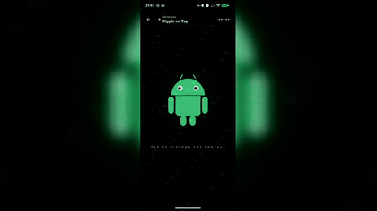

# Dreams — AGSL Engineer Playground

A swipeable Jetpack Compose gallery for learning **Android Graphics Shading Language (AGSL)** by example, plus a fullscreen Showcase tab for screen-recording-grade demos.

## Why

AGSL ships with Android 13+ and lets you author GLSL/Skia-flavoured fragment shaders that drive a Compose `ShaderBrush`, `RuntimeShader`, or `RenderEffect`. There is no shortage of shader theory online — this project translates it into idiomatic Compose lessons that run on a real device.

## Audience

Android engineers who already write Compose UI and want a runnable, bite-sized intro to runtime shaders.

## Demo



## App Shell

Three-tab bottom navigation:

- **Lesson** — pick a category, swipe through lessons, tweak uniforms with sliders.
- **Showcase** — fullscreen, recorder-ready demos.
- **Settings** — reduced-motion toggle, About AGSL, license, GitHub.

Lesson detail screens include learning notes, interactive sliders/color swatches, and line-numbered AGSL source. Last-viewed lesson, favourites, and control values persist across cold start via DataStore.

## Lesson Map

| Category     | Count | Theme                                           |
|--------------|-------|-------------------------------------------------|
| Basics       | 6     | uniforms, fragCoord, gradients, polar coords    |
| Patterns     | 10    | tiles, stripes, repetition                      |
| Color        | 4     | palettes, gradients, tone curves                |
| SDF          | 6     | circle, rounded box, metaballs, breathing grid  |
| Noise        | 6     | hash, value, fBm, voronoi, plasma, lava         |
| Motion       | 4     | time-driven curves, easing, oscillators         |
| Fractals     | 4     | self-similar zooms                              |
| Lighting     | 4     | Lambert, specular, faked depth                  |
| Interactive  | 4     | touch-driven shader experiments                 |
| Post-FX      | 6     | blur, aberration, ripple, dissolve, glass       |
| Showcase     | 1     | ripple-on-tap with starfield + bot halo backdrop |

Categories live in `app/src/main/java/com/dantech/dreams/data/lesson/source/`.

## Stack

- Kotlin / Jetpack Compose / Material3 (BOM `2026.02.01`)
- `minSdk = 33` (`RuntimeShader` requirement), `targetSdk = 36`, JVM 11
- **DI:** Koin (BOM 4.2.0) — Compose + Nav3 integrations
- **Navigation:** Navigation3 (`@Serializable` routes)
- **Persistence:** DataStore Preferences + kotlinx.serialization
- **Tests:** JUnit, Turbine, Koin verify, kotlinx-coroutines-test

Single Gradle module, layered packages: `core/` (agsl, di, motion), `data/`, `domain/`, `ui/feature/`.

## Build & Run

```bash
./gradlew :app:installDebug
```

Open on any Android 13+ device or emulator. CI emulators without GPU may render AGSL stubs.

## Test

```bash
./gradlew test
```

Covers Koin module verification, repository fakes, and ViewModel state via Turbine.

## Docs

- `docs/project-overview-pdr.md` — vision, PDR, architecture
- `docs/system-architecture.md` — package layering and dependency graph
- `docs/code-standards.md` — conventions
- `docs/codebase-summary.md` — at-a-glance file map

## License

MIT — see `LICENSE`. Use it for anything, commercial or otherwise; just keep the copyright notice.

## References

- [Android AGSL docs](https://developer.android.com/develop/ui/views/graphics/agsl)
- [The Book of Shaders](https://thebookofshaders.com/)
- [Inigo Quilez — articles](https://iquilezles.org/articles/)
