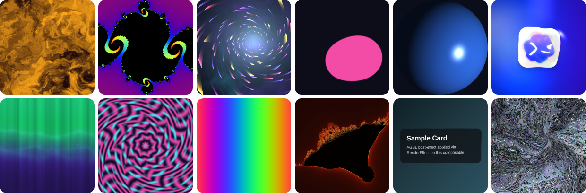
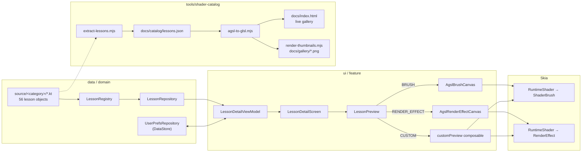

<div align="center">

<a href="https://dantech0xff.github.io/dreams/"></a>

# Dreams — AGSL Engineer Playground

**Learn Android Graphics Shading Language (AGSL) by example.**
56 runnable Jetpack Compose shader lessons — from a solid colour to fBM lava, SDF metaballs, Julia sets and RenderEffects that bend real UI — each with sliders, learning notes and line-numbered source.

[](https://github.com/dantech0xff/dreams/actions/workflows/ci.yml)
[](https://dantech0xff.github.io/dreams/)
[](#lesson-catalog)
[](#build-run-test)
[](gradle/libs.versions.toml)
[](gradle/libs.versions.toml)
[](LICENSE)

[**▶ Live gallery**](https://dantech0xff.github.io/dreams/) · [🎓 Learning path](docs/learning-path.md) · [📖 AGSL cheatsheet](docs/agsl-cheatsheet.md) · [➕ Add a lesson](docs/adding-a-lesson.md) · [🤝 Contributing](CONTRIBUTING.md)

</div>

---

## Why Dreams

AGSL has shipped with every Android 13+ device since 2022, yet almost all shader material online is written for ShaderToy or Unity. Dreams closes that gap for Android engineers:

- **One idea per lesson.** Every lesson is one Kotlin `object` holding one AGSL program, a two-sentence *why*, three *what to notice* notes, and the sliders that matter. Nothing to install or configure to read it — the shader is right there in the file.
- **Runs on a phone, previews in the browser.** The same AGSL source drives the Compose app (`ShaderBrush`, `RenderEffect`) and the [live web gallery](https://dantech0xff.github.io/dreams/), where it is transpiled to GLSL ES 3.00 by the repo's own tooling. Thumbnails on this page were rendered from the lesson source in CI-grade headless Chromium.
- **Production-shaped code, not a scratchpad.** Koin DI, Navigation 3 with `@Serializable` routes, DataStore persistence, immutable UI state, unit-tested registry — the patterns you would use in a real app, applied to shaders.
- **Open source, MIT.** Fork it, ship a lesson, or lift `AgslBrushCanvas` and `Modifier.runtimeShaderEffect` straight into your project.

## Try it

| | |
|---|---|
| **Browser** | Open the [live gallery](https://dantech0xff.github.io/dreams/). Every lesson runs live; drag the sliders, click the canvas for touch lessons, read the AGSL next to it. |
| **Device** | Clone and `./gradlew :app:installDebug` on any Android 13+ device or GPU-backed emulator, or grab `dreams-debug-apk` from the latest [CI run](https://github.com/dantech0xff/dreams/actions/workflows/ci.yml). |
| **Read** | Follow the [learning path](docs/learning-path.md) lesson by lesson, keep the [AGSL cheatsheet](docs/agsl-cheatsheet.md) open, then [write your own lesson](docs/adding-a-lesson.md). |

<p align="center"></p>

The app has three tabs: **Lesson** (categories → lessons → detail with sliders, colour swatches, notes and source), **Showcase** (fullscreen, recorder-ready demos) and **Settings** (theme, reduced motion, dynamic colour). Favourites, last lesson and every slider value survive a cold start.

## Lesson catalog

<!-- catalog:start -->
<!-- Generated by tools/shader-catalog/update-readme.mjs from docs/catalog/lessons.json — do not edit by hand. -->

**56 lessons in 11 categories.** Every thumbnail below was rendered from the lesson's own AGSL by [`tools/shader-catalog`](tools/shader-catalog); click one to open it live in the [web gallery](https://dantech0xff.github.io/dreams/).

| Category | Lessons | Theme | Kind |
|---|:-:|---|---|
| [Basics](#basics) | 6 | Start where pixels meet math | ShaderBrush |
| [Patterns](#patterns) | 10 | Tiles, stripes, and repetition that hypnotize | ShaderBrush |
| [Color](#color) | 4 | Palettes, gradients, and tone curves | ShaderBrush |
| [SDF](#sdf) | 6 | Crisp geometry sculpted from equations | ShaderBrush |
| [Noise](#noise) | 6 | Random fields that read as plasma, lava, smoke | ShaderBrush |
| [Motion](#motion) | 4 | Time-driven curves, easing, and oscillators | ShaderBrush |
| [Fractals](#fractals) | 4 | Self-similar worlds at every zoom | ShaderBrush |
| [Lighting](#lighting) | 4 | Lambert, specular, and fakes that sell depth | ShaderBrush |
| [Interactive](#interactive) | 4 | Touch-driven shader experiments | Touch |
| [Post-FX](#post-fx) | 6 | Bend, blur, and dissolve real Compose UI | RenderEffect |
| [Showcase](#showcase) | 2 | Cinema-mode shaders, ready for the recorder | Showcase |

### Basics

<sub>6 lessons · Start where pixels meet math · [open category live ↗](https://dantech0xff.github.io/dreams/#cat-basics)</sub>

| | Lesson | The idea | Play with |
|:-:|---|---|---|
| <a href="https://dantech0xff.github.io/dreams/#basics-01-solid"></a> | **[Solid Color](app/src/main/java/com/dantech/dreams/data/lesson/source/basics/SolidColor.kt#L10)**<br><sub>⚡<br>`basics-01-solid`</sub> | The simplest shader: every pixel returns the same uniform color. Introduces the half4/uniform basics. | `Base color` |
| <a href="https://dantech0xff.github.io/dreams/#basics-02-animated-color"></a> | **[Animated Color](app/src/main/java/com/dantech/dreams/data/lesson/source/basics/AnimatedColor.kt#L9)**<br><sub>⚡<br>`basics-02-animated-color`</sub> | Drive the output color from a time uniform written every frame via withFrameNanos. The uniform `time` is a float in seconds. | `Speed` |
| <a href="https://dantech0xff.github.io/dreams/#basics-03-linear-gradient"></a> | **[Linear Gradient](app/src/main/java/com/dantech/dreams/data/lesson/source/basics/LinearGradient.kt#L10)**<br><sub>⚡⚡<br>`basics-03-linear-gradient`</sub> | Normalize fragCoord, project it onto a direction vector, then mix two color uniforms along that axis. | `Start color` `End color` `Direction` |
| <a href="https://dantech0xff.github.io/dreams/#basics-04-radial-gradient"></a> | **[Radial Gradient](app/src/main/java/com/dantech/dreams/data/lesson/source/basics/RadialGradient.kt#L9)**<br><sub>⚡⚡<br>`basics-04-radial-gradient`</sub> | length(uv - 0.5) gives distance from screen center. Aspect-correct by multiplying x by width/height. | `Radius` |
| <a href="https://dantech0xff.github.io/dreams/#basics-05-polar-coords"></a> | **[Polar Coordinates](app/src/main/java/com/dantech/dreams/data/lesson/source/basics/PolarCoords.kt#L9)**<br><sub>⚡⚡⚡<br>`basics-05-polar-coords`</sub> | atan(p.y, p.x) gives the angle from origin; combine with length() for swirling polar effects. | `Speed` |
| <a href="https://dantech0xff.github.io/dreams/#basics-06-vignette"></a> | **[Animated Vignette](app/src/main/java/com/dantech/dreams/data/lesson/source/basics/AnimatedVignette.kt#L9)**<br><sub>⚡⚡<br>`basics-06-vignette`</sub> | smoothstep(edge0, edge1, x) gives a soft 0→1 transition. Pair with length() for an antialiased vignette. | `Radius` `Softness` |

### Patterns

<sub>10 lessons · Tiles, stripes, and repetition that hypnotize · [open category live ↗](https://dantech0xff.github.io/dreams/#cat-patterns)</sub>

| | Lesson | The idea | Play with |
|:-:|---|---|---|
| <a href="https://dantech0xff.github.io/dreams/#patterns-01-diagonal-stripes"></a> | **[Diagonal Stripes](app/src/main/java/com/dantech/dreams/data/lesson/source/patterns/PatternsLessons.kt#L11)**<br><sub>⚡<br>`patterns-01-diagonal-stripes`</sub> | Repeat one coordinate with fract(), then threshold it with step(). The skew uniform shears the stripe field. | `Count` `Skew` `Ink A` `Ink B` |
| <a href="https://dantech0xff.github.io/dreams/#patterns-02-polka-dots"></a> | **[Polka Dots](app/src/main/java/com/dantech/dreams/data/lesson/source/patterns/PatternsLessons.kt#L48)**<br><sub>⚡⚡<br>`patterns-02-polka-dots`</sub> | Tile UV space with fract(uv * cells), recenter each tile, then draw one circle SDF per cell. | `Cells` `Radius` |
| <a href="https://dantech0xff.github.io/dreams/#patterns-03-hex-grid"></a> | **[Hex Grid](app/src/main/java/com/dantech/dreams/data/lesson/source/patterns/PatternsLessons.kt#L86)**<br><sub>⚡⚡⚡<br>`patterns-03-hex-grid`</sub> | Compare two offset rectangular lattices and keep the closer center to build a hex-spaced repeat. | `Scale` |
| <a href="https://dantech0xff.github.io/dreams/#patterns-04-truchet"></a> | **[Truchet Tiles](app/src/main/java/com/dantech/dreams/data/lesson/source/patterns/PatternsLessons.kt#L124)**<br><sub>⚡⚡⚡⚡<br>`patterns-04-truchet`</sub> | Hash each cell to choose an orientation, then draw quarter-circle SDFs that connect across tile borders. | `Cells` `Thickness` |
| <a href="https://dantech0xff.github.io/dreams/#patterns-05-moire-interference"></a> | **[Moire Interference](app/src/main/java/com/dantech/dreams/data/lesson/source/patterns/MoireInterference.kt#L9)**<br><sub>⚡⚡⚡<br>`patterns-05-moire-interference`</sub> | Overlay two nearly aligned stripe waves. Tiny angular differences create large beat patterns. | `Density` `Angle` `Contrast` |
| <a href="https://dantech0xff.github.io/dreams/#patterns-06-kaleidoscope-fold"></a> | **[Kaleidoscope Fold](app/src/main/java/com/dantech/dreams/data/lesson/source/patterns/KaleidoscopeFold.kt#L9)**<br><sub>⚡⚡⚡⚡<br>`patterns-06-kaleidoscope-fold`</sub> | Fold polar angle into repeated wedges, then shade the folded space as one mirrored slice. | `Segments` `Twist` `Scale` |
| <a href="https://dantech0xff.github.io/dreams/#patterns-07-plaid-weave"></a> | **[Plaid Weave](app/src/main/java/com/dantech/dreams/data/lesson/source/patterns/PlaidWeave.kt#L9)**<br><sub>⚡⚡<br>`patterns-07-plaid-weave`</sub> | Cross two repeated stripe masks. Alternating cell parity sells the over-under weave. | `Density` `Thread Width` `Contrast` |
| <a href="https://dantech0xff.github.io/dreams/#patterns-08-herringbone-tiles"></a> | **[Herringbone Tiles](app/src/main/java/com/dantech/dreams/data/lesson/source/patterns/HerringboneTiles.kt#L9)**<br><sub>⚡⚡⚡<br>`patterns-08-herringbone-tiles`</sub> | Alternate mirrored tile coordinates so diagonal stripes meet as a herringbone zig-zag. | `Scale` `Width` `Offset` |
| <a href="https://dantech0xff.github.io/dreams/#patterns-09-radial-burst"></a> | **[Radial Burst](app/src/main/java/com/dantech/dreams/data/lesson/source/patterns/RadialBurst.kt#L9)**<br><sub>⚡⚡⚡<br>`patterns-09-radial-burst`</sub> | Repeat angular space instead of UV space. Each repeated sector becomes one ray. | `Rays` `Twist` `Softness` |
| <a href="https://dantech0xff.github.io/dreams/#patterns-10-brick-bond"></a> | **[Brick Bond](app/src/main/java/com/dantech/dreams/data/lesson/source/patterns/BrickBond.kt#L9)**<br><sub>⚡⚡⚡<br>`patterns-10-brick-bond`</sub> | Hash each cell before fract() so the wall allocates stable random brick chunks. | `Scale` `Mortar` `Randomness` |

### Color

<sub>4 lessons · Palettes, gradients, and tone curves · [open category live ↗](https://dantech0xff.github.io/dreams/#cat-color)</sub>

| | Lesson | The idea | Play with |
|:-:|---|---|---|
| <a href="https://dantech0xff.github.io/dreams/#color-01-cosine-palette"></a> | **[IQ Cosine Palette](app/src/main/java/com/dantech/dreams/data/lesson/source/colorlab/ColorLessons.kt#L13)**<br><sub>⚡⚡<br>`color-01-cosine-palette`</sub> | a + b·cos(2π·(c·t + d)) maps a 1D parameter to a smooth color ramp. Six floats define the entire palette. | `Phase` |
| <a href="https://dantech0xff.github.io/dreams/#color-02-hsv-wheel"></a> | **[HSV Wheel](app/src/main/java/com/dantech/dreams/data/lesson/source/colorlab/ColorLessons.kt#L42)**<br><sub>⚡⚡⚡<br>`color-02-hsv-wheel`</sub> | Polar coords give hue (angle) and saturation (radius). hsv2rgb without branches is a four-line piecewise. | `Saturation` |
| <a href="https://dantech0xff.github.io/dreams/#color-03-gradient-stops"></a> | **[Gradient Stops](app/src/main/java/com/dantech/dreams/data/lesson/source/colorlab/ColorLessons.kt#L74)**<br><sub>⚡⚡<br>`color-03-gradient-stops`</sub> | Branch on the parameter for two-segment gradients. Reshape with pow(t, k) to bias toward dark or light. | `Bias` |
| <a href="https://dantech0xff.github.io/dreams/#color-04-aces-tonemap"></a> | **[ACES Tone Map](app/src/main/java/com/dantech/dreams/data/lesson/source/colorlab/ColorLessons.kt#L106)**<br><sub>⚡⚡⚡<br>`color-04-aces-tonemap`</sub> | HDR colors above 1 must be tone-mapped before display. ACES gives a filmic shoulder/toe in 8 ALU ops. | `Exposure` |

### SDF

<sub>6 lessons · Crisp geometry sculpted from equations · [open category live ↗](https://dantech0xff.github.io/dreams/#cat-sdf)</sub>

| | Lesson | The idea | Play with |
|:-:|---|---|---|
| <a href="https://dantech0xff.github.io/dreams/#sdf-01-circle"></a> | **[Circle SDF](app/src/main/java/com/dantech/dreams/data/lesson/source/sdf/SdfLessons.kt#L14)**<br><sub>⚡⚡<br>`sdf-01-circle`</sub> | A signed distance field is a function returning distance to a shape's edge. length(p) - r is the canonical circle. | `Radius` |
| <a href="https://dantech0xff.github.io/dreams/#sdf-02-rounded-box"></a> | **[Rounded Box](app/src/main/java/com/dantech/dreams/data/lesson/source/sdf/SdfLessons.kt#L41)**<br><sub>⚡⚡<br>`sdf-02-rounded-box`</sub> | Box SDF with corner radius: subtract `r` from the distance to round the edges. | `Corner` |
| <a href="https://dantech0xff.github.io/dreams/#sdf-03-metaballs"></a> | **[Smooth Metaballs](app/src/main/java/com/dantech/dreams/data/lesson/source/sdf/SdfLessons.kt#L68)**<br><sub>⚡⚡⚡<br>`sdf-03-metaballs`</sub> | opSmoothUnion(d1,d2,k) blends two SDFs with a smoothness factor — yielding the classic goo/metaball look. | `Smoothness` |
| <a href="https://dantech0xff.github.io/dreams/#sdf-04-checkerboard"></a> | **[Checkerboard](app/src/main/java/com/dantech/dreams/data/lesson/source/sdf/SdfLessons.kt#L100)**<br><sub>⚡⚡<br>`sdf-04-checkerboard`</sub> | floor() + mod() turn continuous space into discrete cells — the simplest periodic pattern. | `Cells` |
| <a href="https://dantech0xff.github.io/dreams/#sdf-05-breathing-grid"></a> | **[Breathing Grid](app/src/main/java/com/dantech/dreams/data/lesson/source/sdf/SdfLessons.kt#L126)**<br><sub>⚡⚡⚡<br>`sdf-05-breathing-grid`</sub> | Tile space with fract(uv * n), then place an animated SDF in each cell. | `Cells` |
| <a href="https://dantech0xff.github.io/dreams/#sdf-06-isolines"></a> | **[Isolines](app/src/main/java/com/dantech/dreams/data/lesson/source/sdf/SdfLessons.kt#L155)**<br><sub>⚡⚡<br>`sdf-06-isolines`</sub> | fract(distance * n) produces concentric rings — a contour-line visualization. | `Density` |

### Noise

<sub>6 lessons · Random fields that read as plasma, lava, smoke · [open category live ↗](https://dantech0xff.github.io/dreams/#cat-noise)</sub>

| | Lesson | The idea | Play with |
|:-:|---|---|---|
| <a href="https://dantech0xff.github.io/dreams/#noise-01-hash"></a> | **[Pseudo-Random Hash](app/src/main/java/com/dantech/dreams/data/lesson/source/noise/NoiseLessons.kt#L9)**<br><sub>⚡⚡<br>`noise-01-hash`</sub> | fract(sin(dot(p, magic)) * big) yields cheap, deterministic per-pixel noise — the bedrock of procedural texturing. | — |
| <a href="https://dantech0xff.github.io/dreams/#noise-02-value"></a> | **[Value Noise](app/src/main/java/com/dantech/dreams/data/lesson/source/noise/NoiseLessons.kt#L31)**<br><sub>⚡⚡<br>`noise-02-value`</sub> | Bilinear-interpolated hash gives smooth-ish noise — the ancestor of Perlin/Simplex. | — |
| <a href="https://dantech0xff.github.io/dreams/#noise-03-fbm"></a> | **[fBM Clouds](app/src/main/java/com/dantech/dreams/data/lesson/source/noise/NoiseLessons.kt#L53)**<br><sub>⚡⚡⚡<br>`noise-03-fbm`</sub> | Sum N octaves of noise, doubling frequency and halving amplitude each step. Bounded loop required for AGSL. | `Octaves` |
| <a href="https://dantech0xff.github.io/dreams/#noise-04-voronoi"></a> | **[Voronoi Cells](app/src/main/java/com/dantech/dreams/data/lesson/source/noise/NoiseLessons.kt#L86)**<br><sub>⚡⚡⚡⚡<br>`noise-04-voronoi`</sub> | For each pixel, find the nearest jittered seed in a 3×3 neighborhood. Animate seeds with sin(time) for cellular life. | `Cells` |
| <a href="https://dantech0xff.github.io/dreams/#noise-05-plasma"></a> | **[Plasma](app/src/main/java/com/dantech/dreams/data/lesson/source/noise/NoiseLessons.kt#L125)**<br><sub>⚡⚡<br>`noise-05-plasma`</sub> | Three sine sums + an HSV-like phase shift = 90s demoscene plasma in 8 lines. | — |
| <a href="https://dantech0xff.github.io/dreams/#noise-06-warped-lava"></a> | **[Warped Lava](app/src/main/java/com/dantech/dreams/data/lesson/source/noise/NoiseLessons.kt#L153)**<br><sub>⚡⚡⚡⚡⚡<br>`noise-06-warped-lava`</sub> | Domain warping: feed fbm into itself. The payoff lesson — looks like a graphics textbook cover. | — |

### Motion

<sub>4 lessons · Time-driven curves, easing, and oscillators · [open category live ↗](https://dantech0xff.github.io/dreams/#cat-motion)</sub>

| | Lesson | The idea | Play with |
|:-:|---|---|---|
| <a href="https://dantech0xff.github.io/dreams/#motion-01-easing"></a> | **[Easing Curves](app/src/main/java/com/dantech/dreams/data/lesson/source/motion/MotionLessons.kt#L12)**<br><sub>⚡⚡<br>`motion-01-easing`</sub> | Easings reshape a 0→1 parameter over time. Compare linear, cubic-out, cubic-in-out, and back-out side by side. | `Speed` |
| <a href="https://dantech0xff.github.io/dreams/#motion-02-harmonics"></a> | **[Sine Harmonics](app/src/main/java/com/dantech/dreams/data/lesson/source/motion/MotionLessons.kt#L59)**<br><sub>⚡⚡⚡<br>`motion-02-harmonics`</sub> | Adding 1/k·sin(k·x) terms approximates a square wave. The Gibbs ringing is visible at the discontinuities. | `Harmonics` |
| <a href="https://dantech0xff.github.io/dreams/#motion-03-wave-train"></a> | **[Wave Train](app/src/main/java/com/dantech/dreams/data/lesson/source/motion/MotionLessons.kt#L98)**<br><sub>⚡⚡<br>`motion-03-wave-train`</sub> | Stack N sine rows offset in phase — each row reads the same wave at a slightly later moment. | `Speed` |
| <a href="https://dantech0xff.github.io/dreams/#motion-04-pendulum-chain"></a> | **[Pendulum Chain](app/src/main/java/com/dantech/dreams/data/lesson/source/motion/MotionLessons.kt#L134)**<br><sub>⚡⚡⚡<br>`motion-04-pendulum-chain`</sub> | N oscillators with detuned frequencies fall in and out of phase — a hypnotic 'pendulum wave'. | `Spread` |

### Fractals

<sub>4 lessons · Self-similar worlds at every zoom · [open category live ↗](https://dantech0xff.github.io/dreams/#cat-fractals)</sub>

| | Lesson | The idea | Play with |
|:-:|---|---|---|
| <a href="https://dantech0xff.github.io/dreams/#fractals-01-mandelbrot"></a> | **[Mandelbrot](app/src/main/java/com/dantech/dreams/data/lesson/source/fractals/FractalsLessons.kt#L9)**<br><sub>⚡⚡⚡⚡<br>`fractals-01-mandelbrot`</sub> | Iterate z ← z² + c until \|z\| escapes. Smooth iteration count + cosine palette gives continuous coloring. | `Zoom` |
| <a href="https://dantech0xff.github.io/dreams/#fractals-02-julia"></a> | **[Julia Set](app/src/main/java/com/dantech/dreams/data/lesson/source/fractals/FractalsLessons.kt#L46)**<br><sub>⚡⚡⚡⚡<br>`fractals-02-julia`</sub> | Same iterate as Mandelbrot, but c is fixed across the plane. Animate c to morph the set in real time. | `Radius` |
| <a href="https://dantech0xff.github.io/dreams/#fractals-03-newton"></a> | **[Newton's Method (z³ − 1)](app/src/main/java/com/dantech/dreams/data/lesson/source/fractals/FractalsLessons.kt#L85)**<br><sub>⚡⚡⚡⚡⚡<br>`fractals-03-newton`</sub> | Newton iteration on z³−1 has 3 attractors. Color each pixel by the root it lands in — basins are fractal. | `Zoom` |
| <a href="https://dantech0xff.github.io/dreams/#fractals-04-sierpinski"></a> | **[Sierpinski Gasket](app/src/main/java/com/dantech/dreams/data/lesson/source/fractals/FractalsLessons.kt#L133)**<br><sub>⚡⚡⚡⚡⚡<br>`fractals-04-sierpinski`</sub> | Iterated function systems: zoom into the corner copy that contains the pixel, repeat, then evaluate one triangle SDF — exact geometric self-similarity. | `Depth` |

### Lighting

<sub>4 lessons · Lambert, specular, and fakes that sell depth · [open category live ↗](https://dantech0xff.github.io/dreams/#cat-lighting)</sub>

| | Lesson | The idea | Play with |
|:-:|---|---|---|
| <a href="https://dantech0xff.github.io/dreams/#lighting-01-lambert"></a> | **[Lambert Sphere](app/src/main/java/com/dantech/dreams/data/lesson/source/lighting/LightingLessons.kt#L22)**<br><sub>⚡⚡<br>`lighting-01-lambert`</sub> | Lambert: diffuse = max(dot(N, L), 0). The whole 'looks 3D' illusion in one inner product. | `Ambient` |
| <a href="https://dantech0xff.github.io/dreams/#lighting-02-phong"></a> | **[Phong Highlight](app/src/main/java/com/dantech/dreams/data/lesson/source/lighting/LightingLessons.kt#L56)**<br><sub>⚡⚡⚡<br>`lighting-02-phong`</sub> | Add specular = pow(max(dot(R, V), 0), n). Shininess collapses the highlight from gloss to mirror. | `Shininess` |
| <a href="https://dantech0xff.github.io/dreams/#lighting-03-rim"></a> | **[Rim Light](app/src/main/java/com/dantech/dreams/data/lesson/source/lighting/LightingLessons.kt#L93)**<br><sub>⚡⚡<br>`lighting-03-rim`</sub> | rim = pow(1 - dot(N, V), p) — sells silhouette and rescues unlit darks. Free 'subsurface' look. | `Power` |
| <a href="https://dantech0xff.github.io/dreams/#lighting-04-terminator"></a> | **[Day/Night Terminator](app/src/main/java/com/dantech/dreams/data/lesson/source/lighting/LightingLessons.kt#L127)**<br><sub>⚡⚡⚡<br>`lighting-04-terminator`</sub> | Same Lambert dot product, but blend between *two* shaded materials. Softness widens the dawn band. | `Softness` |

### Interactive

<sub>4 lessons · Touch-driven shader experiments · [open category live ↗](https://dantech0xff.github.io/dreams/#cat-interactive)</sub>

| | Lesson | The idea | Play with |
|:-:|---|---|---|
| <a href="https://dantech0xff.github.io/dreams/#interactive-01-spotlight"></a> | **[Spotlight](app/src/main/java/com/dantech/dreams/data/lesson/source/interactive/InteractiveLessons.kt#L15)**<br><sub>⚡⚡ · Touch<br>`interactive-01-spotlight`</sub> | touchPos lands as a uniform in 0..1 UV space. Distance + smoothstep gives a soft pool of light at the cursor. | `Radius` |
| <a href="https://dantech0xff.github.io/dreams/#interactive-02-ripple"></a> | **[Tap Ripple](app/src/main/java/com/dantech/dreams/data/lesson/source/interactive/InteractiveLessons.kt#L50)**<br><sub>⚡⚡⚡ · Touch<br>`interactive-02-ripple`</sub> | (time - touchTime) drives a Gaussian band whose radius grows. Re-tap restarts the wave. | `Speed` |
| <a href="https://dantech0xff.github.io/dreams/#interactive-03-pull-field"></a> | **[Pull Field](app/src/main/java/com/dantech/dreams/data/lesson/source/interactive/InteractiveLessons.kt#L90)**<br><sub>⚡⚡⚡ · Touch<br>`interactive-03-pull-field`</sub> | Distort sample coords toward the cursor with exp falloff — texture bends like a gravity well. | `Strength` |
| <a href="https://dantech0xff.github.io/dreams/#interactive-04-heat-stripes"></a> | **[Heat Shockwave](app/src/main/java/com/dantech/dreams/data/lesson/source/interactive/InteractiveLessons.kt#L127)**<br><sub>⚡⚡⚡⚡ · Touch<br>`interactive-04-heat-stripes`</sub> | Combine distance-to-touch with (time - touchTime) inside a sin() — phases sweep outward like a thermal pulse. | `Density` |

### Post-FX

<sub>6 lessons · Bend, blur, and dissolve real Compose UI · [open category live ↗](https://dantech0xff.github.io/dreams/#cat-postfx)</sub>

| | Lesson | The idea | Play with |
|:-:|---|---|---|
| <a href="https://dantech0xff.github.io/dreams/#postfx-01-blur"></a> | **[Box Blur](app/src/main/java/com/dantech/dreams/data/lesson/source/posteffect/PostFxLessons.kt#L33)**<br><sub>⚡⚡ · RenderEffect<br>`postfx-01-blur`</sub> | Average 9 samples around each pixel — the simplest convolution kernel. Increase radius for stronger blur. | `Radius` |
| <a href="https://dantech0xff.github.io/dreams/#postfx-02-chromatic-aberration"></a> | **[Chromatic Aberration](app/src/main/java/com/dantech/dreams/data/lesson/source/posteffect/PostFxLessons.kt#L61)**<br><sub>⚡⚡ · RenderEffect<br>`postfx-02-chromatic-aberration`</sub> | Sample R/G/B at offset coordinates → cheap analog-camera fringe. | `Strength` |
| <a href="https://dantech0xff.github.io/dreams/#postfx-03-ripple-tap"></a> | **[Ripple](app/src/main/java/com/dantech/dreams/data/lesson/source/posteffect/PostFxLessons.kt#L86)**<br><sub>⚡⚡⚡ · RenderEffect<br>`postfx-03-ripple-tap`</sub> | Offset sample coords along radial direction by sin(dist - time) for a continuously-rippling pond. | `Strength` |
| <a href="https://dantech0xff.github.io/dreams/#postfx-04-dissolve"></a> | **[Dissolve](app/src/main/java/com/dantech/dreams/data/lesson/source/posteffect/PostFxLessons.kt#L114)**<br><sub>⚡⚡⚡⚡ · RenderEffect<br>`postfx-04-dissolve`</sub> | Use fbm noise as an animated alpha mask with a glowing edge — Thanos snap on a Composable. | — |
| <a href="https://dantech0xff.github.io/dreams/#postfx-05-displacement-glass"></a> | **[Liquid Glass Displacement](app/src/main/java/com/dantech/dreams/data/lesson/source/posteffect/PostFxLessons.kt#L142)**<br><sub>⚡⚡⚡⚡ · RenderEffect<br>`postfx-05-displacement-glass`</sub> | Sample the input at a noise-displaced coord — produces the iOS 26-style refractive panel feel. | `Strength` |
| <a href="https://dantech0xff.github.io/dreams/#postfx-06-pixelate"></a> | **[Pixelate](app/src/main/java/com/dantech/dreams/data/lesson/source/posteffect/PostFxLessons.kt#L170)**<br><sub>⚡⚡ · RenderEffect<br>`postfx-06-pixelate`</sub> | Snap fragCoord to a grid → mosaic. Increase cell size for chunky retro pixels. | `Cell Size` |

### Showcase

<sub>2 lessons · Cinema-mode shaders, ready for the recorder · [open category live ↗](https://dantech0xff.github.io/dreams/#cat-showcase)</sub>

| | Lesson | The idea | Play with |
|:-:|---|---|---|
| <a href="https://dantech0xff.github.io/dreams/#showcase-05-ripple-on-tap"></a> | **[Ripple on Tap](app/src/main/java/com/dantech/dreams/data/lesson/source/showcase/RippleOnTap.kt#L295)**<br><sub>⚡⚡⚡⚡⚡ · Showcase<br>`showcase-05-ripple-on-tap`</sub> | Multi-touch + drag emit into a 16-slot ripple ring buffer that distorts a live Compose surface (gradient + bokeh + typography). Anisotropic specular streaks along crests, chromatic refraction (R bends more than B), Schlick fresnel sky-tint, foam fringe at peaks. | — |
| <a href="https://dantech0xff.github.io/dreams/#showcase-06-codex-splash"></a> | **[Codex Splash](app/src/main/java/com/dantech/dreams/data/lesson/source/showcase/CodexSplashShowcase.kt#L79)**<br><sub>⚡⚡⚡⚡⚡ · Showcase<br>`showcase-06-codex-splash`</sub> | A procedural Codex-style splash screen: layered AGSL atmosphere, SDF icon tile, cloud glyph, terminal marks, prismatic logo glass, and an interactive water RenderEffect over the composed scene. | — |

<!-- catalog:end -->

## Anatomy of a lesson

A lesson is a Kotlin `object`. Its `init` block registers a `LessonModel`; the category's `*Bootstrap.touch()` references the object so the block runs at startup.

```kotlin
// app/src/main/java/com/dantech/dreams/data/lesson/source/basics/PolarCoords.kt
object PolarCoords {
    val id = "basics-05-polar-coords"

    private val SOURCE = """
        uniform float2 resolution;   // ← written by the runtime on size change
        uniform float time;          // ← written every frame (seconds)
        uniform float speed;         // ← bound to the "Speed" slider below

        half4 main(float2 fragCoord) {
            float2 uv = fragCoord / resolution - 0.5;
            uv.x *= resolution.x / resolution.y;
            float r = length(uv);
            float a = atan(uv.y, uv.x);
            float swirl = a + r * 8.0 - time * speed;
            float v = 0.5 + 0.5 * sin(swirl * 4.0);
            half3 col = mix(half3(0.10, 0.05, 0.30), half3(1.0, 0.45, 0.85), v);
            return half4(col, 1.0);
        }
    """.trimIndent()

    init {
        LessonRegistry.register(
            LessonModel(
                id = id,
                title = "Polar Coordinates",
                category = LessonCategory.BASICS,
                complexity = 3,
                conceptIntro = "atan(p.y, p.x) gives the angle from origin; combine with length() for swirling polar effects.",
                learningNotes = persistentListOf(
                    "length(uv) gives radius: how far the pixel is from center.",
                    "atan(uv.y, uv.x) gives angle: which direction the pixel points.",
                    "Subtracting time * speed shifts the phase, making the swirl rotate.",
                ),
                agslSource = SOURCE,
                controls = persistentListOf(LessonControl.FloatRange("Speed", "speed", 0f, 4f, 1.5f)),
                screenRecordingHint = "Sweep the speed slider 0 → 4 for a hypnotic swirl.",
            )
        )
    }
}
```

**Uniforms are wired by declaration, not by configuration.** The runtime scans the AGSL for the uniforms it knows and only writes the ones it finds (writing an undeclared uniform throws — and aborts the process under CheckJNI):

| Declare this in AGSL | …and the runtime writes | Source |
|---|---|---|
| `uniform float2 resolution;` | canvas size in px, on size change | [`AgslCanvas.kt`](app/src/main/java/com/dantech/dreams/ui/feature/common/AgslCanvas.kt) |
| `uniform float time;` | seconds since first frame, every frame (paused during nav transitions) | [`ShaderTimeUniform.kt`](app/src/main/java/com/dantech/dreams/ui/feature/common/ShaderTimeUniform.kt) |
| `uniform float2 touchPos;` + `uniform float touchTime;` | last tap in 0..1 UV and the `time` it happened; `(-1,-1)` / `-1` before any tap | [`LessonPreview.kt`](app/src/main/java/com/dantech/dreams/ui/feature/lesson/LessonPreview.kt) |
| `uniform float <name>;` + `LessonControl.FloatRange` | the slider value, persisted per lesson (200 ms debounce) | [`ShaderUniformBindings.kt`](app/src/main/java/com/dantech/dreams/ui/feature/common/ShaderUniformBindings.kt) |
| `layout(color) uniform half4 <name>;` + `LessonControl.ColorPicker` | the swatch colour via `setColorUniform` | same |
| `uniform shader content;` | the Compose subtree beneath the effect (Post-FX lessons) | [`ShaderModifiers.kt`](app/src/main/java/com/dantech/dreams/core/agsl/ShaderModifiers.kt) |

**Three render modes** cover everything in the catalog:

| `LessonRenderMode` | What draws | Used by |
|---|---|---|
| `BRUSH` (default) | `drawBehind { drawRect(ShaderBrush(runtimeShader)) }` — uniforms are set *inside* the draw block so state reads invalidate it | 48 lessons |
| `RENDER_EFFECT` | `graphicsLayer { compositingStrategy = Offscreen; renderEffect = createRuntimeShaderEffect(shader, "content") }` over a real composable | 6 Post-FX lessons |
| `CUSTOM` | the lesson supplies its own composable (multi-shader scenes, gesture ring buffers, `FloatArray` uniforms) | 2 showcases |

Two hard-won details are documented right where they bite: a `RenderEffect` renders **nothing** without `CompositingStrategy.Offscreen`, and Skia freezes uniform values when the effect is created, so the effect is rebuilt inside the layer block every frame ([`ShaderModifiers.kt`](app/src/main/java/com/dantech/dreams/core/agsl/ShaderModifiers.kt)).

## Under the hood



| Layer | Choice |
|---|---|
| Language / UI | Kotlin 2.2 · Jetpack Compose · Material 3 (BOM 2026.02.01) |
| Shaders | AGSL via `RuntimeShader` · `ShaderBrush` · `RenderEffect` · `minSdk 33`, `targetSdk 36` |
| Architecture | single Gradle module, layered packages `core/` · `data/` · `domain/` · `ui/feature/` |
| DI / Navigation | Koin 4.2 (BOM) · Navigation 3 with `@Serializable` routes and per-tab back stacks |
| Persistence | DataStore Preferences + kotlinx.serialization (favourites, last lesson, slider and colour overrides, theme) |
| Tests | JUnit 4 · Turbine · Koin `verify()` · kotlinx-coroutines-test — registry counts, control↔uniform matching, ViewModel state, prefs codec |

Deeper reading: [system architecture](docs/system-architecture.md) · [code standards](docs/code-standards.md) · [project overview & PDR](docs/project-overview-pdr.md) · [codebase summary](docs/codebase-summary.md) · [engineering journal](docs/journals/).

## Learning resources in this repo

| Doc | What it is for |
|---|---|
| [Learning path](docs/learning-path.md) | The 56 lessons as a curriculum: what each teaches, which AGSL idea it introduces, what to tweak, concept index. |
| [AGSL cheatsheet](docs/agsl-cheatsheet.md) | AGSL vs GLSL, uniform recipes, the Compose integration patterns used here (with the gotchas), recurring math idioms. |
| [Adding a lesson](docs/adding-a-lesson.md) | Step-by-step contributor recipe with a complete example file and the test/catalog steps. |
| [Live gallery](https://dantech0xff.github.io/dreams/) | Every lesson in the browser with sliders, touch, AGSL and GLSL side by side, deep links per lesson. |

## Build, run, test

Requirements: Android Studio with AGP 9.1 support (or JDK 17+ on the command line), an Android 13+ device or an emulator with GPU rendering (software emulators render AGSL stubs).

```bash
./gradlew :app:installDebug      # build + install the app
./gradlew test                   # JVM unit tests (no device needed)
./gradlew :app:assembleDebug     # APK only
```

### Regenerating the catalog, thumbnails and gallery

```bash
cd tools/shader-catalog
npm install && npx playwright install chromium   # once
npm run all      # extract → thumbnails → README table → docs/index.html
npm run check    # only compile every lesson under WebGL2
```

`lessons.json`, the README catalog and `docs/index.html` are generated from the Kotlin sources; CI fails when they drift. Details in [`tools/shader-catalog/README.md`](tools/shader-catalog/README.md).

### GitHub Pages

The gallery is the `docs/` folder. Enable **Settings → Pages → Source: GitHub Actions** once; [`pages.yml`](.github/workflows/pages.yml) deploys on every push to `master` that touches `docs/`.

## Contributing

New lessons are the most valuable contribution — a well-scoped idea, one AGSL program, three notes on what to notice. Start with [Adding a lesson](docs/adding-a-lesson.md), then read [CONTRIBUTING.md](CONTRIBUTING.md) for the flow, commit style and PR checklist. Bug reports and lesson proposals have [issue templates](.github/ISSUE_TEMPLATE).

Ideas on the roadmap: an in-app AGSL editor, sharing a lesson as a gist, frame-time profiling per lesson, translated learning notes, and community categories (text effects, transitions, 3D raymarching).

## License

MIT — see [LICENSE](LICENSE). Use it for anything, commercial or otherwise; keep the copyright notice.

## References

- [Android AGSL documentation](https://developer.android.com/develop/ui/views/graphics/agsl) and [`RuntimeShader`](https://developer.android.com/reference/android/graphics/RuntimeShader)
- [The Book of Shaders](https://thebookofshaders.com/) — the best gentle introduction to fragment shaders
- [Inigo Quilez — articles](https://iquilezles.org/articles/) — the SDF, palette and noise techniques many lessons build on
