# Learning path

A guided route through all 56 lessons in Dreams, from "return one colour" to a multi-touch water surface refracting live Compose UI. Stages are ordered by concept dependency; inside a stage, lessons appear in the same order as in the app.

## How to use the app

- **Lesson tab** → pick one of 10 category cards → pick a lesson. Each card shows the lesson's complexity (1–5) as bolts.
- **Lesson detail** shows, top to bottom: the live preview (square; tap it in Interactive lessons), the concept intro, controls (sliders and colour swatches, with a reset), a "What to notice" box when the lesson has learning notes (currently Basics and Patterns), an optional "Recording hint", and the AGSL source viewer (expanded by default for Basics).
- **Showcase tab** → the two fullscreen demos.
- Slider and swatch values are written as uniforms of the same name. The runtime only writes uniforms the shader actually declares (it regex-scans the source in `ShaderUniformBindings.kt`), so a control whose uniform you delete simply stops doing anything. `resolution` (float2, device px) and `time` (float, seconds) are written automatically when declared.
- To experiment, edit the `SOURCE` string inside a lesson's Kotlin `object` and rebuild with `./gradlew :app:assembleDebug`. `./gradlew test` asserts the per-category lesson counts and that every control targets a declared uniform, so adding a lesson means updating `LessonRegistryTest.kt` too.

## How to use the gallery

- Every lesson has a thumbnail in [`docs/gallery/`](gallery/) named `<lesson-id>.png`, rendered from the same AGSL via a WebGL2 transpiler. Regenerate with `node tools/shader-catalog/render-thumbnails.mjs` (`--check` only compiles, `--only <id>` renders one).
- `node tools/shader-catalog/build-site.mjs` builds the static web gallery at `docs/index.html` (live WebGL previews with sliders).
- Both read [`docs/catalog/lessons.json`](catalog/lessons.json), regenerated by `node tools/shader-catalog/extract-lessons.mjs`. Tooling needs Node.js 20+ and Playwright with Chromium (`npm i -D playwright && npx playwright install chromium` inside `tools/shader-catalog`).

## Uniforms the runtime provides

Declare a uniform and the preview fills it in; leave it out and nothing is written.

| Uniform | Type | Written by | Notes |
|---|---|---|---|
| `resolution` | `float2` | `AgslCanvas.kt` | Canvas size in device px; needed to normalise `fragCoord` |
| `time` | `float` | `ShaderTimeUniform.kt` | Seconds since the preview started, advanced with `withFrameNanos`; paused during navigation transitions |
| `touchPos`, `touchTime` | `float2`, `float` | `LessonPreview.kt` | Last tap in 0..1 UV and the `time` at which it happened; `(-1, -1)` / `-1` before any tap. Both must be declared for tap handling to switch on |
| `content` | `shader` | `AgslRenderEffectCanvas` | Post-FX only: the Compose content beneath the effect, read with `content.eval(coord)` |
| control uniforms | `float`, `half4` | `ShaderUniformBindings.kt` | Each `FloatRange` control writes a `float`; each `ColorPicker` writes a `layout(color) half4` |

Stage order below differs slightly from the app's category order (the app lists Color before SDF and Fractals before Lighting); either order works.

## Reading the tables

| Column | Meaning |
|---|---|
| Lesson | Title (linked to the Kotlin file that registers it), lesson id, complexity out of 5 |
| AGSL idea introduced | The intrinsic or technique the lesson is built around |
| What to tweak | Control label and the uniform it writes; `—` means the lesson is time-driven or gesture-driven only |

## 1. Foundations

*Basics — 6 lessons.* Learn what a fragment shader *is*: one `main` per pixel, uniforms as the only input, `resolution` and `time` as the two you get for free. Everything later is built from `mix`, `length`, `atan` and `smoothstep`.

| Preview | Lesson | What it teaches | AGSL idea introduced | What to tweak |
|---|---|---|---|---|
|  | [Solid Color](../app/src/main/java/com/dantech/dreams/data/lesson/source/basics/SolidColor.kt) `basics-01-solid` · 1/5 | Every pixel returns the same colour; the skeleton of an AGSL program. | `half4 main(float2 fragCoord)`, `layout(color) uniform half4` | Base color (`baseColor`) |
|  | [Animated Color](../app/src/main/java/com/dantech/dreams/data/lesson/source/basics/AnimatedColor.kt) `basics-02-animated-color` · 1/5 | A `time` uniform written every frame makes unchanged code animate. | `uniform float time`, `sin`, `mix` | Speed (`speed`) |
| 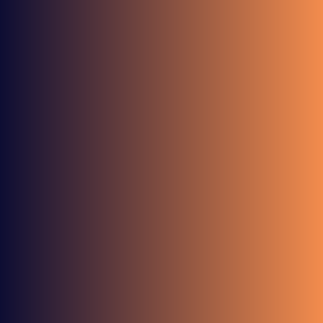 | [Linear Gradient](../app/src/main/java/com/dantech/dreams/data/lesson/source/basics/LinearGradient.kt) `basics-03-linear-gradient` · 2/5 | Normalise `fragCoord` by `resolution`, project it onto a direction, blend two colours. | `uniform float2 resolution`, `dot`, `cos`/`sin`, `clamp` | Start color (`startColor`), End color (`endColor`), Direction (`angle`) |
| 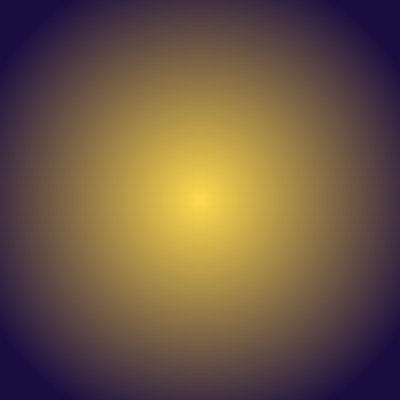 | [Radial Gradient](../app/src/main/java/com/dantech/dreams/data/lesson/source/basics/RadialGradient.kt) `basics-04-radial-gradient` · 2/5 | Distance from the centre, with aspect correction so circles stay round. | `length`, `uv.x *= resolution.x / resolution.y` | Radius (`radius`) |
| 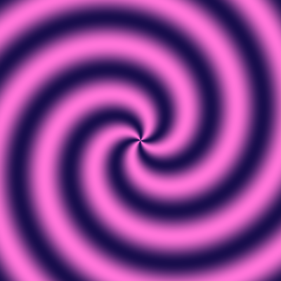 | [Polar Coordinates](../app/src/main/java/com/dantech/dreams/data/lesson/source/basics/PolarCoords.kt) `basics-05-polar-coords` · 3/5 | Angle + radius give polar space; subtracting `time` rotates the swirl. | `atan(y, x)` | Speed (`speed`) |
|  | [Animated Vignette](../app/src/main/java/com/dantech/dreams/data/lesson/source/basics/AnimatedVignette.kt) `basics-06-vignette` · 2/5 | A soft, antialiased edge from two distance thresholds. | `smoothstep(edge0, edge1, x)` | Radius (`radius`), Softness (`softness`) |

By the end of this stage you can read any lesson's `main`: it turns `fragCoord` into a centred, aspect-correct `uv`, computes one or two scalars from it, and `mix`es colours by those scalars.

## 2. Coordinates and repetition

*Patterns — 10 lessons.* `fract` repeats a coordinate, `floor` names the cell you are in, and `atan` lets you repeat *angle* instead of position. Ten variations on that single trick.

| Preview | Lesson | What it teaches | AGSL idea introduced | What to tweak |
|---|---|---|---|---|
| 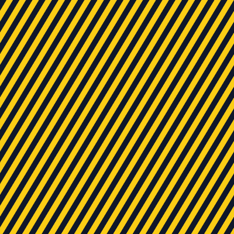 | [Diagonal Stripes](../app/src/main/java/com/dantech/dreams/data/lesson/source/patterns/PatternsLessons.kt) `patterns-01-diagonal-stripes` · 1/5 | Repeat one coordinate with `fract`, threshold it with `step`, shear with `skew`. | `fract`, `step` | Count (`count`), Skew (`skew`), Ink A (`inkA`), Ink B (`inkB`) |
| 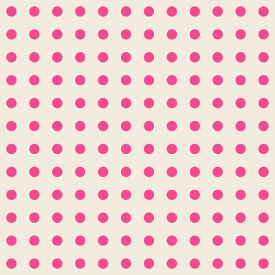 | [Polka Dots](../app/src/main/java/com/dantech/dreams/data/lesson/source/patterns/PatternsLessons.kt) `patterns-02-polka-dots` · 2/5 | Tile UV space, recentre each tile, draw one circle per cell. | `fract(uv * cells) - 0.5` | Cells (`cells`), Radius (`radius`) |
| 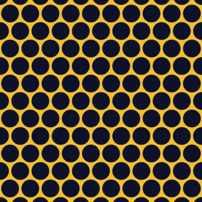 | [Hex Grid](../app/src/main/java/com/dantech/dreams/data/lesson/source/patterns/PatternsLessons.kt) `patterns-03-hex-grid` · 3/5 | Two half-offset rectangular lattices; keep the nearer centre to get hex spacing. | `mod`, ternary select on `dot(r1, r1) < dot(r2, r2)` | Scale (`scale`) |
| 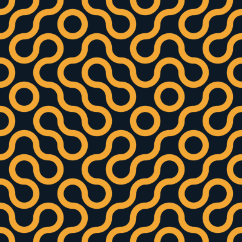 | [Truchet Tiles](../app/src/main/java/com/dantech/dreams/data/lesson/source/patterns/PatternsLessons.kt) `patterns-04-truchet` · 4/5 | A per-cell hash picks the tile orientation so quarter-arcs join across borders. | `floor` cell id + `hash21`, `distance`, `min` | Cells (`cells`), Thickness (`thickness`) |
| 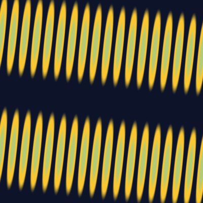 | [Moire Interference](../app/src/main/java/com/dantech/dreams/data/lesson/source/patterns/MoireInterference.kt) `patterns-05-moire-interference` · 3/5 | Two nearly aligned sine stripe fields; their difference is a large beat pattern. | `sin(dot(uv, dirB) * density)`, `abs` | Density (`density`), Angle (`angle`), Contrast (`contrast`) |
| 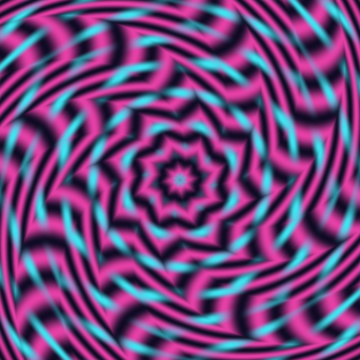 | [Kaleidoscope Fold](../app/src/main/java/com/dantech/dreams/data/lesson/source/patterns/KaleidoscopeFold.kt) `patterns-06-kaleidoscope-fold` · 4/5 | Fold the polar angle into wedges and mirror each wedge. | `mod(angle + wedge * 0.5, wedge)`, `abs` as a mirror | Segments (`segments`), Twist (`twist`), Scale (`scale`) |
| 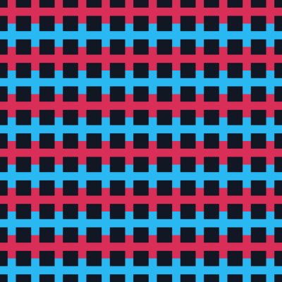 | [Plaid Weave](../app/src/main/java/com/dantech/dreams/data/lesson/source/patterns/PlaidWeave.kt) `patterns-07-plaid-weave` · 2/5 | Cross two stripe masks; cell parity flips the over/under thread colour. | `floor` parity, `clamp` | Density (`density`), Thread Width (`threadWidth`), Contrast (`contrast`) |
| 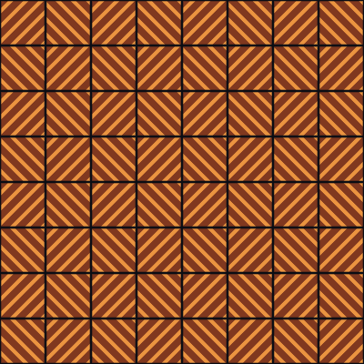 | [Herringbone Tiles](../app/src/main/java/com/dantech/dreams/data/lesson/source/patterns/HerringboneTiles.kt) `patterns-08-herringbone-tiles` · 3/5 | Alternate mirrored tile coordinates so diagonal stripes meet as a zig-zag. | `mod(tile.x + tile.y, 2.0)`, coordinate mirroring | Scale (`scale`), Width (`width`), Offset (`offset`) |
| 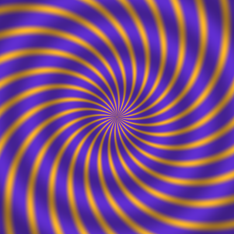 | [Radial Burst](../app/src/main/java/com/dantech/dreams/data/lesson/source/patterns/RadialBurst.kt) `patterns-09-radial-burst` · 3/5 | Repeat angular space instead of UV space; each sector becomes a ray. | `fract(angle / 6.28318530718 * rays)` | Rays (`rays`), Twist (`twist`), Softness (`softness`) |
| 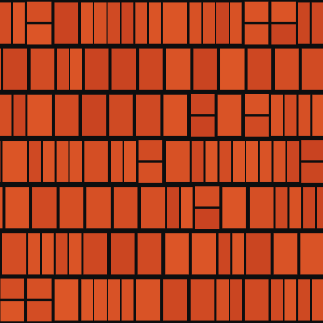 | [Brick Bond](../app/src/main/java/com/dantech/dreams/data/lesson/source/patterns/BrickBond.kt) `patterns-10-brick-bond` · 3/5 | Hash rows and cells before `fract` to shift and split bricks; edge distance becomes mortar. | non-square scaling `float2(scale * 1.7, scale)`, `min` edge distance | Scale (`scale`), Mortar (`mortar`), Randomness (`randomness`) |

## 3. Shape (SDF)

*SDF — 6 lessons.* Signed distance fields describe geometry as "how far am I from the edge". Threshold with `smoothstep` for antialiasing, combine with `opSmoothUnion`, tile with `fract`.

| Preview | Lesson | What it teaches | AGSL idea introduced | What to tweak |
|---|---|---|---|---|
| 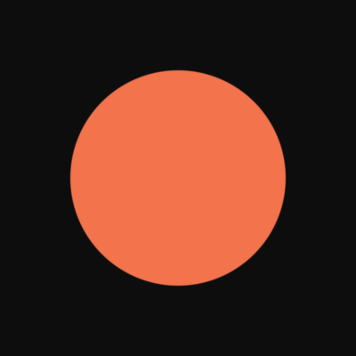 | [Circle SDF](../app/src/main/java/com/dantech/dreams/data/lesson/source/sdf/SdfLessons.kt) `sdf-01-circle` · 2/5 | A signed distance field returns distance to an edge; threshold it for a crisp shape. | `sdCircle` = `length(p) - r`, `1.0 - smoothstep(0.0, 0.005, d)` | Radius (`radius`) |
|  | [Rounded Box](../app/src/main/java/com/dantech/dreams/data/lesson/source/sdf/SdfLessons.kt) `sdf-02-rounded-box` · 2/5 | Box SDF; subtracting a radius rounds the corners. | `sdBox` (`abs`, `max`, `min`) | Corner (`corner`) |
| 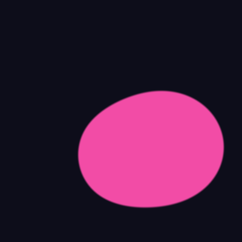 | [Smooth Metaballs](../app/src/main/java/com/dantech/dreams/data/lesson/source/sdf/SdfLessons.kt) `sdf-03-metaballs` · 3/5 | Blend three moving circle SDFs into goo. | `opSmoothUnion(d1, d2, k)` | Smoothness (`smoothness`) |
| 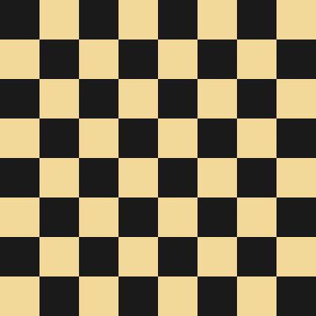 | [Checkerboard](../app/src/main/java/com/dantech/dreams/data/lesson/source/sdf/SdfLessons.kt) `sdf-04-checkerboard` · 2/5 | Turn continuous space into discrete cells. | `floor`, `mod(x + y, 2.0)` | Cells (`cells`) |
| 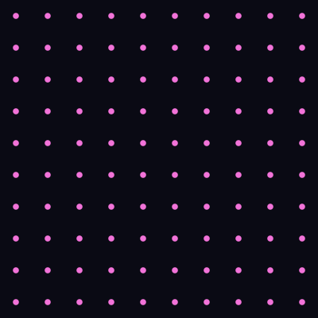 | [Breathing Grid](../app/src/main/java/com/dantech/dreams/data/lesson/source/sdf/SdfLessons.kt) `sdf-05-breathing-grid` · 3/5 | Tile space and animate one SDF per cell. | `fract(uv * cells) - 0.5`, `sin(time)`-driven radius | Cells (`cells`) |
| 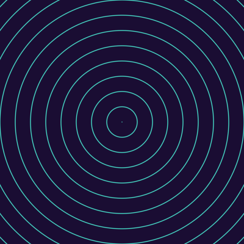 | [Isolines](../app/src/main/java/com/dantech/dreams/data/lesson/source/sdf/SdfLessons.kt) `sdf-06-isolines` · 2/5 | Contour rings from the fractional part of distance. | `abs(fract(r * density) - 0.5)` | Density (`density`) |

The helpers `sdCircle`, `sdBox` and `opSmoothUnion` are shared through `SDF_HELPERS` in `SdfHelpers.kt`; Checkerboard, Breathing Grid and Isolines inline their own math.

## 4. Colour

*Color — 4 lessons.* Palettes as functions: cosine ramps, HSV, biased gradients and tone-mapping HDR values back into 0..1.

| Preview | Lesson | What it teaches | AGSL idea introduced | What to tweak |
|---|---|---|---|---|
| 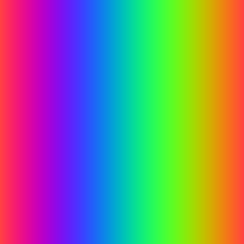 | [IQ Cosine Palette](../app/src/main/java/com/dantech/dreams/data/lesson/source/colorlab/ColorLessons.kt) `color-01-cosine-palette` · 2/5 | Four `float3` constants define a full palette: `a + b·cos(2π(c·t + d))`. | vector `cos` on `float3` | Phase (`shift`) |
|  | [HSV Wheel](../app/src/main/java/com/dantech/dreams/data/lesson/source/colorlab/ColorLessons.kt) `color-02-hsv-wheel` · 3/5 | Hue from angle, saturation from radius, branch-free `hsv2rgb`. | `mod` on `float3`, `min`/`max` piecewise | Saturation (`saturation`) |
| 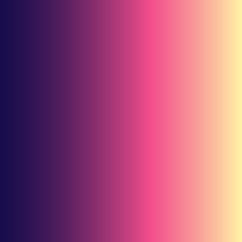 | [Gradient Stops](../app/src/main/java/com/dantech/dreams/data/lesson/source/colorlab/ColorLessons.kt) `color-03-gradient-stops` · 2/5 | Two-segment gradient; a power curve biases the ramp dark or light. | `pow(t, mix(0.4, 2.5, bias))`, ternary branch | Bias (`bias`) |
|  | [ACES Tone Map](../app/src/main/java/com/dantech/dreams/data/lesson/source/colorlab/ColorLessons.kt) `color-04-aces-tonemap` · 3/5 | HDR values above 1.0 need a filmic curve before display. | ACES rational curve, `exp` sun, `clamp` | Exposure (`exposure`) |

## 5. Signal and noise

*Noise — 6 lessons.* From a one-line hash to domain-warped fBM. `NOISE_HELPERS` in `NoiseHelpers.kt` (`hash21`, `valueNoise`, `fbm`) is prepended to every lesson here except Plasma, and reused by Truchet Tiles, Dissolve and Liquid Glass Displacement.

| Preview | Lesson | What it teaches | AGSL idea introduced | What to tweak |
|---|---|---|---|---|
| 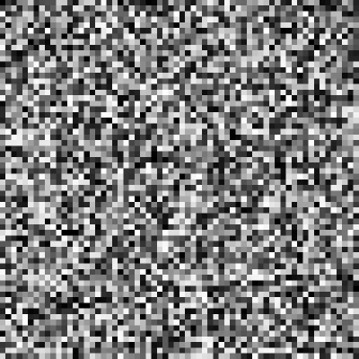 | [Pseudo-Random Hash](../app/src/main/java/com/dantech/dreams/data/lesson/source/noise/NoiseLessons.kt) `noise-01-hash` · 2/5 | Cheap deterministic per-cell randomness. | `hash21` = `fract(sin(dot(p, float2(12.9898, 78.233))) * 43758.5453)` | — |
|  | [Value Noise](../app/src/main/java/com/dantech/dreams/data/lesson/source/noise/NoiseLessons.kt) `noise-02-value` · 2/5 | Bilinear interpolation of hashed corners with a smooth fade. | `valueNoise`, `mix` of 4 corners, `f * f * (3.0 - 2.0 * f)` | — |
|  | [fBM Clouds](../app/src/main/java/com/dantech/dreams/data/lesson/source/noise/NoiseLessons.kt) `noise-03-fbm` · 3/5 | Sum octaves, doubling frequency and halving amplitude each step. | bounded `for` loop with `break` on `octaves` | Octaves (`octaves`) |
| 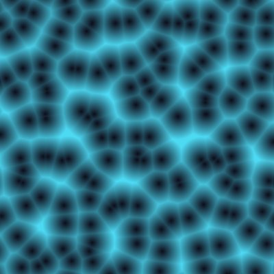 | [Voronoi Cells](../app/src/main/java/com/dantech/dreams/data/lesson/source/noise/NoiseLessons.kt) `noise-04-voronoi` · 4/5 | Nearest jittered seed in a 3×3 neighbourhood; seeds orbit with `sin(time)`. | nested loops, `dot(r, r)` min-distance, `sqrt` | Cells (`cells`) |
| 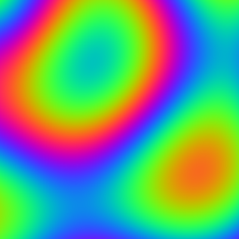 | [Plasma](../app/src/main/java/com/dantech/dreams/data/lesson/source/noise/NoiseLessons.kt) `noise-05-plasma` · 2/5 | Three sine sums and a phase-shifted RGB mapping. | `sin` sums, 2π/3 channel phase offsets | — |
| 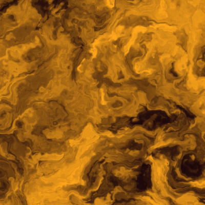 | [Warped Lava](../app/src/main/java/com/dantech/dreams/data/lesson/source/noise/NoiseLessons.kt) `noise-06-warped-lava` · 5/5 | Domain warping: feed `fbm` into itself twice. | `fbm(p + 4.0 * r)` | — |

## 6. Motion

*Motion — 4 lessons.* Time as a design material: easing curves, Fourier sums, phase offsets and detuned oscillators.

| Preview | Lesson | What it teaches | AGSL idea introduced | What to tweak |
|---|---|---|---|---|
| 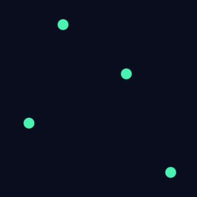 | [Easing Curves](../app/src/main/java/com/dantech/dreams/data/lesson/source/motion/MotionLessons.kt) `motion-01-easing` · 2/5 | Four easings of the same 0→1 parameter, side by side. | `easeOutCubic`, `easeInOutCubic`, `easeOutBack`, `fract(time * speed * 0.25)` | Speed (`speed`) |
| 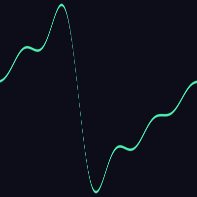 | [Sine Harmonics](../app/src/main/java/com/dantech/dreams/data/lesson/source/motion/MotionLessons.kt) `motion-02-harmonics` · 3/5 | Sum `1/k · sin(k·x)` terms toward a square wave; Gibbs ringing appears. | loop with `break` on `harmonic` | Harmonics (`harmonic`) |
| 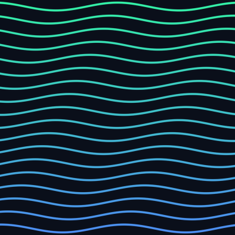 | [Wave Train](../app/src/main/java/com/dantech/dreams/data/lesson/source/motion/MotionLessons.kt) `motion-03-wave-train` · 2/5 | Stack sine rows offset in phase; each row reads the wave slightly later. | `floor`/`fract` row split, per-row phase | Speed (`speed`) |
| 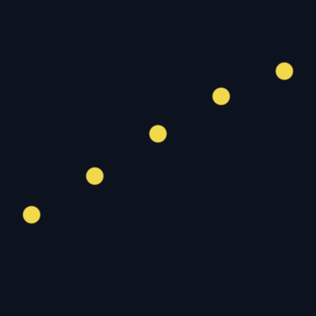 | [Pendulum Chain](../app/src/main/java/com/dantech/dreams/data/lesson/source/motion/MotionLessons.kt) `motion-04-pendulum-chain` · 3/5 | Detuned oscillators drift out of and back into phase. | `sin(time * f)` with `f = 1 + i·spread`, `min` over dots | Spread (`spread`) |

## 7. Light

*Lighting — 4 lessons.* All four lessons shade the same implicit sphere (`sphereSample`), so the only thing that changes is the lighting term.

| Preview | Lesson | What it teaches | AGSL idea introduced | What to tweak |
|---|---|---|---|---|
| 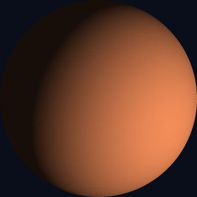 | [Lambert Sphere](../app/src/main/java/com/dantech/dreams/data/lesson/source/lighting/LightingLessons.kt) `lighting-01-lambert` · 2/5 | Diffuse = `max(dot(N, L), 0)`; the entire "looks 3D" illusion. | `normalize`, `dot`, `max`, implicit sphere normal `sqrt(1 - r²)` | Ambient (`ambient`) |
| 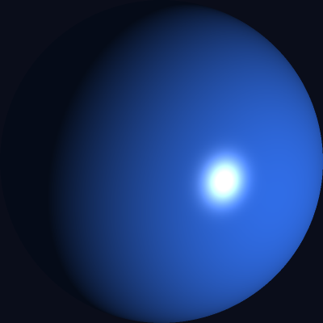 | [Phong Highlight](../app/src/main/java/com/dantech/dreams/data/lesson/source/lighting/LightingLessons.kt) `lighting-02-phong` · 3/5 | Add specular = `pow(max(dot(R, V), 0), n)`. | `reflect(-L, n)`, `pow` | Shininess (`shininess`) |
| 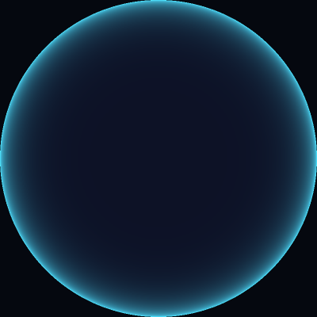 | [Rim Light](../app/src/main/java/com/dantech/dreams/data/lesson/source/lighting/LightingLessons.kt) `lighting-03-rim` · 2/5 | Rim = `pow(1 - dot(N, V), p)` brightens silhouettes. | view vector `V`, `pow` | Power (`power`) |
| 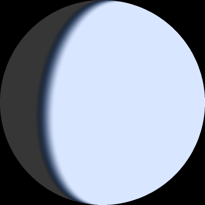 | [Day/Night Terminator](../app/src/main/java/com/dantech/dreams/data/lesson/source/lighting/LightingLessons.kt) `lighting-04-terminator` · 3/5 | Same N·L, but blend two materials across a soft terminator band. | `smoothstep(-softness, softness, lambert)` | Softness (`softness`) |

## 8. Fractals

*Fractals — 4 lessons.* Bounded loops doing complex arithmetic. `cmul`, `cdiv` and `smoothEscape` come from `FRACTAL_HELPERS` in `FractalsHelpers.kt`; Sierpinski swaps escape-time for an inverse IFS.

| Preview | Lesson | What it teaches | AGSL idea introduced | What to tweak |
|---|---|---|---|---|
| 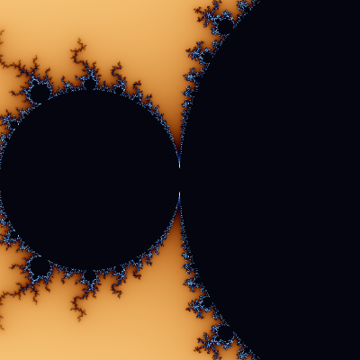 | [Mandelbrot](../app/src/main/java/com/dantech/dreams/data/lesson/source/fractals/FractalsLessons.kt) `fractals-01-mandelbrot` · 4/5 | Iterate `z ← z² + c` until `dot(z, z)` passes the escape radius; a smooth iteration count feeds a cosine palette. | `cmul`, `smoothEscape` (`log2`), `const int MAX` loop with `break` | Zoom (`zoom`) |
| 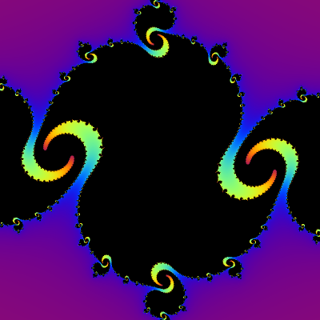 | [Julia Set](../app/src/main/java/com/dantech/dreams/data/lesson/source/fractals/FractalsLessons.kt) `fractals-02-julia` · 4/5 | Same iteration, but `c` is fixed per frame and orbits with `time`, so the set morphs. | `cmul`, `time`-driven parameter | Radius (`radius`) |
| 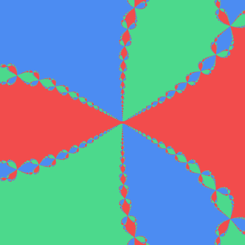 | [Newton's Method (z³ − 1)](../app/src/main/java/com/dantech/dreams/data/lesson/source/fractals/FractalsLessons.kt) `fractals-03-newton` · 5/5 | Newton iteration on `z³ − 1`; colour each pixel by the root it converges to. | `cdiv`, nearest-root selection with `distance` | Zoom (`zoom`) |
| 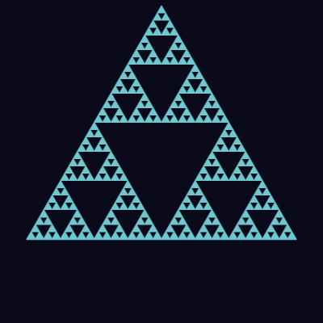 | [Sierpinski Gasket](../app/src/main/java/com/dantech/dreams/data/lesson/source/fractals/FractalsLessons.kt) `fractals-04-sierpinski` · 5/5 | Inverse IFS: zoom into the corner copy containing the pixel, repeat, then evaluate one triangle SDF. | `p = 2.0 * p - corner`, `sdTri`, `sign` | Depth (`depth`) |

AGSL only compiles loops with compile-time-constant bounds, so every fractal loop runs to a fixed bound (`const int MAX` in Mandelbrot, Julia and Newton; a literal `8` in Sierpinski). Mandelbrot, Julia and Sierpinski `break` early — the same pattern fBM Clouds and Sine Harmonics use to let a slider control the iteration count — while Newton always runs all 32 steps.

## 9. Interaction

*Interactive — 4 lessons.* Tap the preview: the runtime writes `touchPos` (0..1 UV, `(-1,-1)` before any tap) and `touchTime` (seconds, `-1` before any tap). Every lesson here degrades gracefully before the first tap.

| Preview | Lesson | What it teaches | AGSL idea introduced | What to tweak |
|---|---|---|---|---|
|  | [Spotlight](../app/src/main/java/com/dantech/dreams/data/lesson/source/interactive/InteractiveLessons.kt) `interactive-01-spotlight` · 2/5 | `touchPos` (0..1 UV) becomes the centre of a soft pool of light. | `uniform float2 touchPos`, fallback when `touchPos.x < 0.0` | Radius (`radius`) |
|  | [Tap Ripple](../app/src/main/java/com/dantech/dreams/data/lesson/source/interactive/InteractiveLessons.kt) `interactive-02-ripple` · 3/5 | `time - touchTime` grows a Gaussian ring; re-tapping restarts it. | `uniform float touchTime`, `exp(-pow(x, 2.0))` | Speed (`speed`) |
| 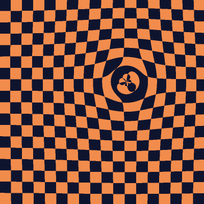 | [Pull Field](../app/src/main/java/com/dantech/dreams/data/lesson/source/interactive/InteractiveLessons.kt) `interactive-03-pull-field` · 3/5 | Bend sample coordinates toward the touch point like a gravity well. | `normalize(d) * pull`, `exp` falloff | Strength (`strength`) |
|  | [Heat Shockwave](../app/src/main/java/com/dantech/dreams/data/lesson/source/interactive/InteractiveLessons.kt) `interactive-04-heat-stripes` · 4/5 | Distance and tap age inside one `sin` sweep phase outward. | `sin(-age * 6.0 + r * density)` | Density (`density`) |

## 10. Post-FX on real UI

*Post-FX — 6 lessons.* These run as a `RenderEffect` over a real Compose card (`SampleContent`). `uniform shader content` is the UI beneath; `content.eval(coord)` reads it. `fragCoord` is in device pixels here, so Box Blur's `radius`, Chromatic Aberration's `strength` and Pixelate's `cellSize` are pixel offsets.

| Preview | Lesson | What it teaches | AGSL idea introduced | What to tweak |
|---|---|---|---|---|
|  | [Box Blur](../app/src/main/java/com/dantech/dreams/data/lesson/source/posteffect/PostFxLessons.kt) `postfx-01-blur` · 2/5 | Average 9 samples of the UI beneath: the simplest convolution. | `uniform shader content`, `content.eval(fragCoord + o)` | Radius (`radius`) |
| 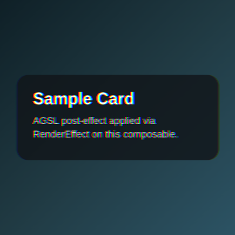 | [Chromatic Aberration](../app/src/main/java/com/dantech/dreams/data/lesson/source/posteffect/PostFxLessons.kt) `postfx-02-chromatic-aberration` · 2/5 | Sample R, G and B at different offsets for a lens fringe. | per-channel `content.eval(...).r/.g/.b` | Strength (`strength`) |
| 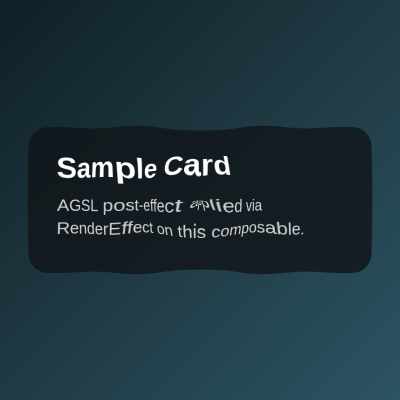 | [Ripple](../app/src/main/java/com/dantech/dreams/data/lesson/source/posteffect/PostFxLessons.kt) `postfx-03-ripple-tap` · 3/5 | Displace samples radially by `sin(d * 0.05 - time * 4.0)` with exponential falloff. | `distance`, `normalize`, `exp` | Strength (`strength`) |
| 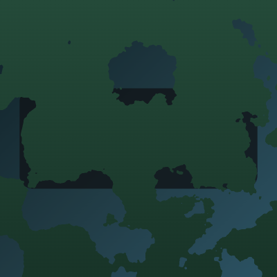 | [Dissolve](../app/src/main/java/com/dantech/dreams/data/lesson/source/posteffect/PostFxLessons.kt) `postfx-04-dissolve` · 4/5 | `fbm` as an animated alpha mask with a glowing edge. | `step(threshold, n)`, writing `c.a * half(a)` to alpha | — |
| 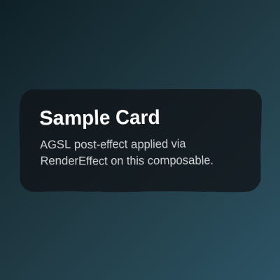 | [Liquid Glass Displacement](../app/src/main/java/com/dantech/dreams/data/lesson/source/posteffect/PostFxLessons.kt) `postfx-05-displacement-glass` · 4/5 | Sample the input at noise-displaced coordinates for a refractive panel. | `fbm` offset scaled by `resolution` | Strength (`strength`) |
| 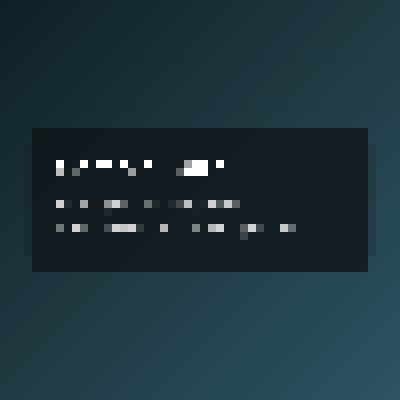 | [Pixelate](../app/src/main/java/com/dantech/dreams/data/lesson/source/posteffect/PostFxLessons.kt) `postfx-06-pixelate` · 2/5 | Snap `fragCoord` to a grid and sample cell centres. | `floor(fragCoord / cellSize) * cellSize` | Cell Size (`cellSize`) |

On the Compose side this is `Modifier.runtimeShaderEffect` in `core/agsl/ShaderModifiers.kt`: `compositingStrategy = Offscreen` is mandatory (otherwise there is no buffer for `content` to sample) and the effect is rebuilt every frame because Skia freezes uniform values when the effect is created.

## 11. Showcases

*Showcase — 2 lessons.* Fullscreen, `CUSTOM` render mode: each showcase owns its shader, time, gestures and backdrop. Read these after Interaction and Post-FX.

| Preview | Lesson | What it teaches | AGSL idea introduced | What to tweak |
|---|---|---|---|---|
|  | [Ripple on Tap](../app/src/main/java/com/dantech/dreams/data/lesson/source/showcase/RippleOnTap.kt) `showcase-05-ripple-on-tap` · 5/5 | Multi-touch ripples in a 16-slot ring buffer refract a live Compose backdrop, with anisotropic specular, Schlick fresnel, caustics and foam. | `uniform float rip[64]`, constant-stride array indexing, `content.eval` refraction | — |
|  | [Codex Splash](../app/src/main/java/com/dantech/dreams/data/lesson/source/showcase/CodexSplashShowcase.kt) `showcase-06-codex-splash` · 5/5 | Three shaders layered: atmosphere background, SDF icon tile, and an interactive water RenderEffect over the composed scene. | `extraAgslSources`, `ShaderBrush` layers + RenderEffect | — |

Ripple on Tap binds its backdrop (`RippleBackdrop.kt`) as `content`, keeps 16 ripple slots of `(x, y, t0, strength)` in one `float[64]` uniform, and notes an AGSL rule worth knowing: array indices inside a loop must be a constant multiple of the loop variable plus a constant (`rip[i * 4 + 1]`), not a precomputed variable. Codex Splash registers three sources: the background is `agslSource`, the icon and water shaders are `extraAgslSources` (`CodexSplashShaders.kt`, `CodexSplashWaterSurface.kt`).

## Suggested detours

- Short on time? Do Foundations, then `patterns-01-diagonal-stripes`, `sdf-01-circle`, `noise-03-fbm`, `lighting-01-lambert`, `interactive-01-spotlight`, `postfx-01-blur`. That is one lesson per core idea.
- Want visuals fast? The catalog's hero picks are `noise-06-warped-lava`, `fractals-02-julia`, `patterns-06-kaleidoscope-fold`, `sdf-03-metaballs`, `lighting-02-phong`, `noise-04-voronoi`, `patterns-04-truchet`, `color-01-cosine-palette`, `fractals-03-newton`, `postfx-05-displacement-glass` and the two showcases (`tools/shader-catalog/thumb-states.mjs`).
- Building a real UI effect? Go straight to Post-FX, then read `ShaderModifiers.kt` and `RippleOnTap.kt`.

## Concept index

| AGSL concept | Lessons |
|---|---|
| Program shape: `half4 main(float2 fragCoord)` | `basics-01-solid` |
| Uniforms, `layout(color) uniform half4` | `basics-01-solid`, `basics-03-linear-gradient`, `patterns-01-diagonal-stripes` |
| `resolution` and aspect correction | `basics-03-linear-gradient`, `basics-04-radial-gradient`, `sdf-01-circle` |
| `time` (seconds, written every frame) | `basics-02-animated-color`, `basics-05-polar-coords`, `sdf-03-metaballs`, `noise-05-plasma`, `motion-03-wave-train` |
| `mix` | `basics-02-animated-color`, `basics-03-linear-gradient`, `color-03-gradient-stops` |
| `smoothstep` (antialiasing, soft masks) | `basics-06-vignette`, `sdf-01-circle`, `patterns-05-moire-interference`, `lighting-04-terminator` |
| `step` | `patterns-01-diagonal-stripes`, `patterns-07-plaid-weave`, `postfx-04-dissolve` |
| `fract` (repetition) | `patterns-01-diagonal-stripes`, `patterns-02-polka-dots`, `sdf-05-breathing-grid`, `sdf-06-isolines`, `patterns-09-radial-burst` |
| `floor` / `mod` (cell ids, parity) | `sdf-04-checkerboard`, `patterns-03-hex-grid`, `patterns-07-plaid-weave`, `patterns-08-herringbone-tiles`, `postfx-06-pixelate` |
| `length` / `distance` | `basics-04-radial-gradient`, `sdf-01-circle`, `patterns-04-truchet`, `postfx-03-ripple-tap` |
| `atan(y, x)` (polar coordinates) | `basics-05-polar-coords`, `patterns-06-kaleidoscope-fold`, `patterns-09-radial-burst`, `color-02-hsv-wheel` |
| `dot` (projection, N·L) | `basics-03-linear-gradient`, `patterns-05-moire-interference`, `lighting-01-lambert` |
| `abs` as a mirror | `patterns-06-kaleidoscope-fold`, `patterns-08-herringbone-tiles`, `sdf-06-isolines` |
| `clamp` | `basics-03-linear-gradient`, `patterns-07-plaid-weave`, `color-04-aces-tonemap` |
| `pow` (bias, specular, rim) | `color-03-gradient-stops`, `lighting-02-phong`, `lighting-03-rim` |
| `exp` (falloff) | `color-04-aces-tonemap`, `interactive-02-ripple`, `interactive-03-pull-field`, `postfx-03-ripple-tap` |
| `normalize`, `reflect` | `lighting-01-lambert`, `lighting-02-phong`, `interactive-03-pull-field` |
| Vector `cos` palettes | `color-01-cosine-palette`, `fractals-01-mandelbrot`, `fractals-02-julia` |
| HSV → RGB | `color-02-hsv-wheel` |
| Tone mapping (ACES) | `color-04-aces-tonemap` |
| Hash (`hash21`) | `noise-01-hash`, `patterns-04-truchet`, `patterns-10-brick-bond` |
| Value noise | `noise-02-value` |
| fBM (octave loop) | `noise-03-fbm`, `postfx-04-dissolve`, `postfx-05-displacement-glass` |
| Domain warping | `noise-06-warped-lava` |
| Voronoi / nearest seed | `noise-04-voronoi` |
| SDF primitives (`sdCircle`, `sdBox`, `sdTri`) | `sdf-01-circle`, `sdf-02-rounded-box`, `fractals-04-sierpinski` |
| `opSmoothUnion` | `sdf-03-metaballs` |
| Bounded loops with early `break` | `noise-03-fbm`, `motion-02-harmonics`, `fractals-01-mandelbrot`, `fractals-04-sierpinski` |
| Nested loops (neighbourhood / kernel) | `noise-04-voronoi`, `postfx-01-blur` |
| Easing functions | `motion-01-easing` |
| Fourier sums, phase offsets, detuning | `motion-02-harmonics`, `motion-03-wave-train`, `motion-04-pendulum-chain` |
| Complex arithmetic (`cmul`, `cdiv`, `smoothEscape`) | `fractals-01-mandelbrot`, `fractals-02-julia`, `fractals-03-newton` |
| Iterated function systems | `fractals-04-sierpinski` |
| Implicit sphere normal | `lighting-01-lambert`, `lighting-02-phong`, `lighting-03-rim`, `lighting-04-terminator` |
| `touchPos` / `touchTime` | `interactive-01-spotlight`, `interactive-02-ripple`, `interactive-03-pull-field`, `interactive-04-heat-stripes` |
| `uniform shader content` + `content.eval` | `postfx-01-blur` … `postfx-06-pixelate`, `showcase-05-ripple-on-tap`, `showcase-06-codex-splash` |
| Writing alpha from a shader | `postfx-04-dissolve` |
| Uniform float arrays | `showcase-05-ripple-on-tap`, `showcase-06-codex-splash` |
| Multiple shaders per lesson (`extraAgslSources`) | `showcase-06-codex-splash` |

## See also

- [README](../README.md) — install, build and the lesson catalog.
- [System architecture](system-architecture.md) — Koin modules, Navigation3 shell, ViewModels, `LessonRepository` and DataStore.
- [Adding a lesson](adding-a-lesson.md) — checklist for registering a new lesson and regenerating the catalog.
- [Code standards](code-standards.md) — Kotlin, Compose and testing conventions.
