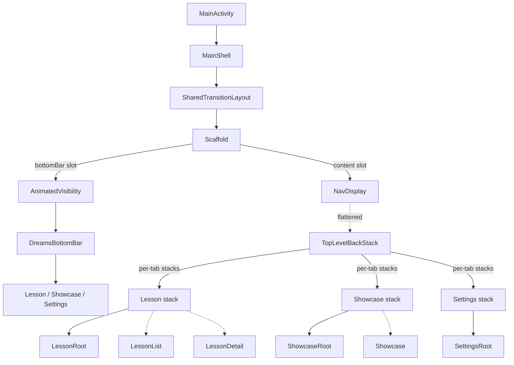

# Phase 01 — Navigation Shell & Routes

## Context Links

- Reports:
  - [/plans/reports/researcher-260506-0724-navigation3-multi-stack.md](../reports/researcher-260506-0724-navigation3-multi-stack.md)
  - [/plans/reports/researcher-260506-0724-bottom-bar-ux.md](../reports/researcher-260506-0724-bottom-bar-ux.md)
- Existing: `app/src/main/java/com/dantech/dreams/ui/feature/nav/PlaygroundNavHost.kt`
- Existing: `app/src/main/java/com/dantech/dreams/ui/feature/nav/Route.kt`
- Existing: `app/src/main/java/com/dantech/dreams/MainActivity.kt`
- Existing: `app/src/main/java/com/dantech/dreams/core/motion/AppMotionState.kt`

## Overview

- Priority: P1 (blocker for all subsequent phases)
- Status: completed
- Brief: Build the shell — new routes, `TopLevelBackStack` helper, `MainShell` composable with single `NavDisplay`, `AnimatedVisibility`-wrapped bottom bar, and rewire `MainActivity`. Keep old `PlaygroundApp()` & old routes alive in parallel until phase-05.

## Key Insights from Research

- Canonical pattern is **single `NavDisplay` + `TopLevelBackStack` flattening helper** (NOT sibling/nested NavDisplays). Source: developer.android.com Nav3 Common UI recipe.
- Only one `SharedTransitionLayout` per nav hierarchy — single NavDisplay = compliant.
- `rememberNavBackStack` survives process death via internal `rememberSaveable` + kotlinx-serialization on `NavKey`. Custom holders need a `Saver`.
- Route-driven `AnimatedVisibility` in Scaffold's `bottomBar` slot handles bar hide/show with smooth slide and automatic inset recompute.

## Requirements

### Functional

- App launches into Lesson tab (default).
- Three bottom tabs: Lesson / Showcase / Settings.
- Each tab has its own back stack preserved across tab switches.
- Bottom bar visible on tab roots (`LessonRoot`, `LessonList`, `ShowcaseRoot`, `SettingsRoot`); hidden on `LessonDetail` and `Showcase(lessonId)` (fullscreen routes).
- Tap-current-tab pops to root of that tab.
- System back: pops within active tab's stack; if at depth 1, falls back to LRU previous tab.
- Survives config change (rotation) and process death.

### Non-Functional

- File size <200 lines per `development-rules.md`.
- Reduced-motion respected: `AnimatedVisibility` uses `snap()` when `motion.reducedMotion`.
- Existing `SharedTransitionLayout` + `LocalSharedTransitionScope` wiring preserved.
- No regression to existing `LessonDetailScreen` shared-bounds animation (Gallery removed but the destination key `lesson-card-{id}` is still produced by `LessonCard` reused in phase-02).

## Architecture



### TopLevelBackStack Data Flow

- **In:** Tab clicks → `switchTopLevel(key)`. Drill-down → `add(key)`. System back → `removeLast()`. Tap-current → `popToRoot()`.
- **Transform:** Mutates per-tab `SnapshotStateList`s; emits flattened `backStack` for `NavDisplay`.
- **Out:** `NavDisplay` recomposes; bottom-bar visibility `derivedStateOf(backStack.lastOrNull())`.

## Related Code Files

### Modify

- `/Users/dan/Desktop/Development/Android-Kotlin/dreams/app/src/main/java/com/dantech/dreams/ui/feature/nav/Route.kt`
  - Add new routes: `LessonRoot`, `LessonList(category: String)`, `ShowcaseRoot`, `SettingsRoot`. Keep existing `LessonDetail`, `Showcase` (already exist & needed). Keep `Landing`, `Gallery` for now (deleted in phase-05).
  - Add tab-key sealed type or just use root NavKeys directly.
- `/Users/dan/Desktop/Development/Android-Kotlin/dreams/app/src/main/java/com/dantech/dreams/MainActivity.kt`
  - Change `setContent { DreamsTheme { PlaygroundApp() } }` → `setContent { DreamsTheme { MainShell() } }`.
- `/Users/dan/Desktop/Development/Android-Kotlin/dreams/app/build.gradle.kts`
  - Verify `androidx.compose.material:material-icons-core` is on classpath (likely transitive via Material3 BOM). Add explicit dep if absent.

### Create

- `/Users/dan/Desktop/Development/Android-Kotlin/dreams/app/src/main/java/com/dantech/dreams/ui/feature/nav/MainShell.kt`
  - The new shell composable. <200 lines target.
- `/Users/dan/Desktop/Development/Android-Kotlin/dreams/app/src/main/java/com/dantech/dreams/ui/feature/nav/TopLevelBackStack.kt`
  - The helper class + `rememberTopLevelBackStack` Saver. <120 lines target.
- `/Users/dan/Desktop/Development/Android-Kotlin/dreams/app/src/main/java/com/dantech/dreams/ui/feature/nav/DreamsBottomBar.kt`
  - The Material3 NavigationBar composable. ~60 lines.
- `/Users/dan/Desktop/Development/Android-Kotlin/dreams/app/src/main/java/com/dantech/dreams/ui/feature/nav/TabKey.kt`
  - Optional: enum/sealed of Lesson/Showcase/Settings with their root NavKey + icon + label. Keeps DreamsBottomBar declarative.

### Delete

- None this phase. (Old `PlaygroundNavHost.kt` stays alive — unreferenced after MainActivity rewires — until phase-05.)

## Implementation Steps

1. **Verify icon dep.** Open `app/build.gradle.kts`. Confirm `androidx.compose.material:material-icons-core` present (transitively or explicit). If missing, add `implementation("androidx.compose.material:material-icons-core")`. Run `./gradlew :app:assembleDebug` to confirm.

2. **Extend `Route.kt`.** Add the new tab roots and intermediate routes. Keep existing `Landing`, `Gallery`, `LessonDetail`, `Showcase` untouched. New entries:
   ```kotlin
   @Serializable data object LessonRoot : Route
   @Serializable data class LessonList(val categoryName: String) : Route
   @Serializable data object ShowcaseRoot : Route
   @Serializable data object SettingsRoot : Route
   ```
   Why `categoryName: String` (not `LessonCategory`): kotlinx-serialization on enums is fine but routes ideally stay primitive — easier process-death recovery if enum order changes.

3. **Create `TabKey.kt`.** Three-entry sealed class or enum mapping each tab to (root NavKey, label, icon).
   ```kotlin
   enum class TabKey(val root: Route, val label: String, val icon: ImageVector) {
       LESSON(Route.LessonRoot, "Lesson", Icons.Filled.List),
       SHOWCASE(Route.ShowcaseRoot, "Showcase", Icons.Filled.Star),
       SETTINGS(Route.SettingsRoot, "Settings", Icons.Filled.Settings),
   }
   ```

4. **Create `TopLevelBackStack.kt`.**
   - Class `TopLevelBackStack<T : NavKey>(startKey: T)` with `topLevelStacks: LinkedHashMap<T, SnapshotStateList<T>>`, `topLevelKey by mutableStateOf`, `backStack = mutableStateListOf<T>()`.
   - Methods: `switchTopLevel(key)`, `add(key)`, `removeLast()`, `popToRoot()`.
   - LRU re-order on `switchTopLevel` (matches official recipe).
   - `rememberTopLevelBackStack(start: T): TopLevelBackStack<T>` using `rememberSaveable(saver = ...)`.
   - Saver strategy: serialize `topLevelKey` + `topLevelStacks` as a `Pair<String, Map<String, List<String>>>` of JSON-encoded NavKeys. Use `Json.encodeToString(NavKey.serializer().polymorphic(...), key)` — confirm exact API; fallback (acceptable for MVP) is to NOT save process death but only config change via `rememberSaveable` with built-in `listSaver` over enum names + a list of route IDs. **Spike during this step**: try the polymorphic kotlinx serialization first; if cost > 1h, fall back to a hand-rolled saver that handles the 6 known route types.
   - Public surface kept tight.

5. **Create `DreamsBottomBar.kt`.**
   - Renders `NavigationBar { TabKey.entries.forEach { NavigationBarItem(...) } }`.
   - `selected = topLevel.topLevelKey == tab.root`.
   - `onClick`: if selected → `topLevel.popToRoot()`; else → `topLevel.switchTopLevel(tab.root)`.
   - `label = { Text(tab.label) }` — always shown.
   - `icon = { Icon(tab.icon, contentDescription = tab.label) }`.

6. **Create `MainShell.kt`.**
   - `@Composable fun MainShell()` — entry composable.
   - `val motion = rememberAppMotionState()`.
   - `val topLevel = rememberTopLevelBackStack(Route.LessonRoot)`.
   - `val showBar by remember(topLevel) { derivedStateOf { topLevel.backStack.lastOrNull().let { it is Route.LessonRoot || it is Route.LessonList || it is Route.ShowcaseRoot || it is Route.SettingsRoot } } }`.
   - Wrap in `SharedTransitionLayout { CompositionLocalProvider(LocalSharedTransitionScope provides this) { ... } }`.
   - `Scaffold(bottomBar = { AnimatedVisibility(visible = showBar, enter = if (motion.reducedMotion) fadeIn(snap()) else slideInVertically { it } + fadeIn(), exit = ...) { DreamsBottomBar(topLevel) } })`.
   - `NavDisplay(backStack = topLevel.backStack, onBack = { topLevel.removeLast() }, entryDecorators = listOf(rememberSaveableStateHolderNavEntryDecorator(), rememberViewModelStoreNavEntryDecorator()), transitionSpec = sameAsExistingPlaygroundNavHost, popTransitionSpec = sameAsExistingPlaygroundNavHost, modifier = Modifier.padding(scaffoldPadding), entryProvider = entryProvider { /* phase-02..04 register entries */ })`.
   - For now (this phase only) register stub `entry<Route.LessonRoot> { Text("Lesson Root — phase-02") }`, `entry<Route.ShowcaseRoot> { Text("Showcase Root — phase-03") }`, `entry<Route.SettingsRoot> { Text("Settings Root — phase-04") }`. Do NOT register `LessonList`, `LessonDetail`, `Showcase` yet.
   - Keep existing fade transition spec from `PlaygroundNavHost.kt` lines 43–58 verbatim.

7. **Wire `MainActivity`.** Change the `setContent` call to `MainShell()`. Old `PlaygroundApp()` becomes unreferenced but still compiles.

8. **Compile sanity check.** Run `./gradlew :app:assembleDebug`. Must pass.

9. **Smoke test (manual, optional this phase).** Install on device. Expect: bottom bar with 3 stub tabs visible, each tab shows placeholder text, bar visible on all routes (no hide-routes registered yet). Tab switching swaps content. System back from Lesson root closes app (correct).

## Todo List

- [ ] Verify `material-icons-core` on classpath; add if missing
- [ ] Extend `Route.kt` with `LessonRoot`, `LessonList`, `ShowcaseRoot`, `SettingsRoot`
- [ ] Create `TabKey.kt`
- [ ] Create `TopLevelBackStack.kt` with saver
- [ ] Create `DreamsBottomBar.kt`
- [ ] Create `MainShell.kt` with stub entries
- [ ] Rewire `MainActivity` to `MainShell()`
- [ ] `./gradlew :app:assembleDebug` passes
- [ ] Manual smoke: 3 tabs render, switch works

## Success Criteria

- App builds and installs.
- Launches to Lesson tab; bottom bar visible with 3 items + labels + correct selection state.
- Tapping each tab swaps content (stub text); already-selected tap does nothing visible (no drill-down yet to pop).
- Rotation: selected tab persists (visible by which item is highlighted). Verifies saver works at least for config change.
- No console crash, no shared-transition warning in logcat.

## Risk Assessment

| Risk | Likelihood | Impact | Mitigation |
|---|---|---|---|
| `TopLevelBackStack` Saver too complex; process death restoration broken | Medium | Medium | Spike-cap at 1h; fallback to config-change-only saver for MVP. Document as known limitation; revisit. |
| `Icons.Filled.List` / `Star` / `Settings` not on core classpath | Low | Low | Step 1 verifies; explicit dep adds <50KB. |
| `AnimatedVisibility` in `bottomBar` slot causes Scaffold inset jitter on first hide | Low | Low | Confirmed by Compose AnimatedVisibility examples; if jitter visible, use `slideInVertically/slideOutVertically` only (no fade) and tween `tween(durationMs)`. |
| Shared-transition warnings due to single SharedTransitionLayout for non-shared routes | Very Low | Low | Already in use today; pattern unchanged. |
| Tab switch animates as a "navigate" via NavDisplay's transitionSpec causing weird crossfade | Medium | Low | Acceptable — fade between tab roots is fine. If undesired, use a `contentKey` keyed by `topLevelKey` so NavDisplay treats tab switch differently. Tune in phase-06. |

## Security Considerations

n/a — UI refactor only. No new IO, no new persistence, no new permissions.

## Next Steps

- Phase-02 wires actual `LessonCategoriesScreen`, `LessonListScreen`, `LessonDetailScreen` into the entry provider.
- Phase-03 wires `ShowcaseListScreen`, `ShowcaseScreen` into the entry provider.
- Phase-04 wires `SettingsScreen` into the entry provider.

## File Ownership

This phase owns:
- `ui/feature/nav/Route.kt` (modify)
- `ui/feature/nav/MainShell.kt` (create)
- `ui/feature/nav/TopLevelBackStack.kt` (create)
- `ui/feature/nav/DreamsBottomBar.kt` (create)
- `ui/feature/nav/TabKey.kt` (create)
- `MainActivity.kt` (modify — single line)
- `app/build.gradle.kts` (touch only if dep missing)

No other phase touches these files until phase-05 cleanup.
