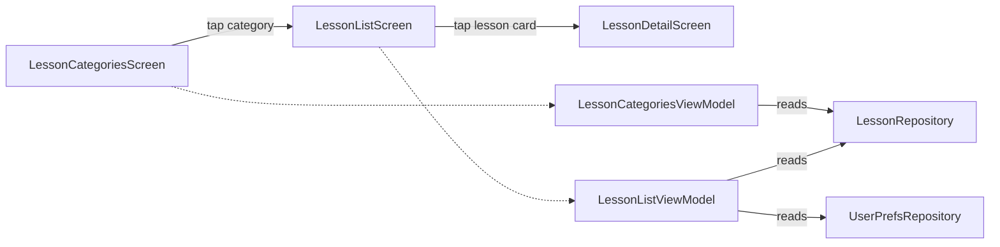

# Phase 02 — Lesson Tab Screens (Categories → List → Detail)

## Context Links

- Reports:
  - [/plans/reports/researcher-260506-0724-navigation3-multi-stack.md](../reports/researcher-260506-0724-navigation3-multi-stack.md)
- Existing: `app/src/main/java/com/dantech/dreams/ui/feature/gallery/GalleryScreen.kt`
- Existing: `app/src/main/java/com/dantech/dreams/ui/feature/gallery/GalleryViewModel.kt`
- Existing: `app/src/main/java/com/dantech/dreams/ui/feature/gallery/LessonCard.kt`
- Existing: `app/src/main/java/com/dantech/dreams/ui/feature/lesson/LessonDetailScreen.kt`
- Existing: `app/src/main/java/com/dantech/dreams/data/lesson/LessonCategory.kt`
- Existing: `app/src/main/java/com/dantech/dreams/data/lesson/LessonRepositoryImpl.kt`
- Existing: `app/src/main/java/com/dantech/dreams/domain/lesson/LessonRepository.kt`
- Phase-01 plan: [phase-01-navigation-shell-and-routes.md](phase-01-navigation-shell-and-routes.md)

## Overview

- Priority: P1
- Status: completed
- Brief: Build the Lesson tab's 3-level drill-down. Root = `LessonCategoriesScreen` (4 cards: Basics, SDF, Noise, Post-FX). Level 2 = `LessonListScreen` (LazyColumn of `LessonCard` filtered by category). Level 3 = existing `LessonDetailScreen`. Wire all into `MainShell`'s entry provider.

## Key Insights from Research

- Single `NavDisplay` means we just register more `entry<Route.X>` blocks; no nested host needed.
- `LessonCard.kt:22` exposes `lessonSharedKey(lessonId)` — same key used by `LessonDetailScreen.kt:43`. Reusing `LessonCard` in `LessonListScreen` preserves the existing shared-bounds animation Lesson list → Detail. **Free**.
- `LessonCategory` enum at `data/lesson/LessonCategory.kt:1-9` includes `SHOWCASE`. Lesson sources still register lessons under that category (`LessonRegistry.kt:32` → `ShowcaseBootstrap.touch()`). We must NOT remove `SHOWCASE` from the enum — only filter it out at the UI layer.

## Requirements

### Functional

- `LessonCategoriesScreen` shows exactly **4** category cards: Basics, SDF, Noise, Post-FX. Showcase EXCLUDED.
- Tap card → navigate to `LessonList(categoryName)` with that category's lessons.
- `LessonListScreen` shows TopAppBar with category title + back button, LazyColumn of `LessonCard` for that category.
- Tap card → navigate to existing `LessonDetail(lessonId)`. Shared-bounds animation preserved.
- Favorite toggle on cards continues to work (writes through `UserPrefsRepository.toggleFavorite`).
- Last-viewed lesson highlighted (existing behavior in `GalleryUiState`); not required to keep but note.
- Back from Detail returns to List with scroll position preserved (`SaveableStateHolder` decorator handles this).
- Back from List returns to Categories.

### Non-Functional

- File size <200 lines per file.
- Reuse `LessonCard` from `ui/feature/gallery/` until phase-05 (in phase-05, move `LessonCard.kt` into a shared package — see phase-05).
- VM pattern: `StateFlow<UiState>` + Koin DI, mirror existing `GalleryViewModel`.

## Architecture



### Data Flow

- **LessonCategoriesViewModel:** Static list of 4 categories (compile-time constant from `LessonCategory.lessonOnly()` helper). No flows, no params. Could be a stateless composable, but VM keeps DI consistency and allows future "lesson count per category" badges.
- **LessonListViewModel:** Constructor params `categoryName: String`, `repo: LessonRepository`, `prefs: UserPrefsRepository`. Decode `categoryName` → `LessonCategory.valueOf(categoryName)`. Call `repo.byCategory(cat)`. Subscribe to `prefs.prefsFlow` for `favorites` updates. Expose `LessonListUiState(category, lessons, favorites, lastLessonId)`. Action: `toggleFavorite(id)`.

## Related Code Files

### Modify

- `/Users/dan/Desktop/Development/Android-Kotlin/dreams/app/src/main/java/com/dantech/dreams/data/lesson/LessonCategory.kt`
  - Add a top-level helper:
    ```kotlin
    fun LessonCategory.Companion.lessonOnly(): List<LessonCategory> =
        entries.filter { it != SHOWCASE }
    ```
  - (Or a non-companion extension; companion approach is cleaner.) Requires adding a `companion object` to the enum.
- `/Users/dan/Desktop/Development/Android-Kotlin/dreams/app/src/main/java/com/dantech/dreams/core/di/FeatureModule.kt`
  - Add `viewModel { LessonCategoriesViewModel() }`
  - Add `viewModel { (categoryName: String) -> LessonListViewModel(get(), get(), categoryName) }`
  - Do NOT remove `LandingViewModel` / `GalleryViewModel` yet — phase-05.
- `/Users/dan/Desktop/Development/Android-Kotlin/dreams/app/src/main/java/com/dantech/dreams/ui/feature/nav/MainShell.kt`
  - Replace stub `entry<Route.LessonRoot> { Text(...) }` with `LessonCategoriesScreen(onCategoryClick = { cat -> topLevel.add(Route.LessonList(cat.name)) })`.
  - Add `entry<Route.LessonList> { route -> LessonListScreen(categoryName = route.categoryName, onLessonClick = { id -> topLevel.add(routeForLessonId(id)) }, onBack = { topLevel.removeLast() }) }`.
  - Add `entry<Route.LessonDetail> { route -> LessonDetailScreen(onBack = { topLevel.removeLast() }, vm = koinViewModel { parametersOf(route.lessonId) }) }`.

### Create

- `/Users/dan/Desktop/Development/Android-Kotlin/dreams/app/src/main/java/com/dantech/dreams/ui/feature/lessonlist/LessonCategoriesScreen.kt` (~80 lines)
- `/Users/dan/Desktop/Development/Android-Kotlin/dreams/app/src/main/java/com/dantech/dreams/ui/feature/lessonlist/LessonCategoriesViewModel.kt` (~30 lines)
- `/Users/dan/Desktop/Development/Android-Kotlin/dreams/app/src/main/java/com/dantech/dreams/ui/feature/lessonlist/LessonCategoriesUiState.kt` (~15 lines)
- `/Users/dan/Desktop/Development/Android-Kotlin/dreams/app/src/main/java/com/dantech/dreams/ui/feature/lessonlist/LessonListScreen.kt` (~100 lines)
- `/Users/dan/Desktop/Development/Android-Kotlin/dreams/app/src/main/java/com/dantech/dreams/ui/feature/lessonlist/LessonListViewModel.kt` (~60 lines)
- `/Users/dan/Desktop/Development/Android-Kotlin/dreams/app/src/main/java/com/dantech/dreams/ui/feature/lessonlist/LessonListUiState.kt` (~20 lines)

Note: chose package `feature/lessonlist/` (kebab-style mental model, snake-case Kotlin package) to disambiguate from `feature/lesson/` which holds Detail. Acceptable because Kotlin packages are lowercase.

### Delete

- None this phase. (`feature/landing/`, `feature/gallery/`, old `SettingsSheet.kt` deleted in phase-05.)

## Implementation Steps

1. **Add `lessonOnly()` helper to `LessonCategory.kt`.**
   ```kotlin
   enum class LessonCategory(val displayName: String) {
       BASICS("Basics"), SDF("SDF"), NOISE("Noise"), POSTFX("Post-FX"), SHOWCASE("Showcase");
       companion object {
           fun lessonOnly(): List<LessonCategory> = entries.filter { it != SHOWCASE }
       }
   }
   ```

2. **Create `LessonCategoriesUiState.kt`.** Minimal: `data class LessonCategoriesUiState(val categories: ImmutableList<LessonCategoryItem>)`. `LessonCategoryItem(category: LessonCategory, count: Int)` — counts come from `repo.byCategory(c).size`. (Counts nice-to-have; optional for MVP.)

3. **Create `LessonCategoriesViewModel.kt`.** Constructor `(repo: LessonRepository)`. In `init` build immutable list from `LessonCategory.lessonOnly()` mapped with counts. Expose `StateFlow<LessonCategoriesUiState>`.

4. **Create `LessonCategoriesScreen.kt`.**
   - `Scaffold` with TopAppBar "Lessons".
   - `LazyColumn` of category cards. Each card a `Card { Column { Text(displayName) ; Text("$count lessons") } }` with `clickable { onCategoryClick(cat) }`.
   - Receives `onCategoryClick: (LessonCategory) -> Unit`.

5. **Create `LessonListUiState.kt`.** `data class LessonListUiState(val category: LessonCategory, val lessons: ImmutableList<LessonModel>, val favorites: PersistentSet<String>, val lastLessonId: String)`.

6. **Create `LessonListViewModel.kt`.** Mirror `GalleryViewModel.kt:17-62`:
   - Constructor `(repo: LessonRepository, prefs: UserPrefsRepository, categoryName: String)`.
   - Decode category in init: `val cat = LessonCategory.valueOf(categoryName)`.
   - Initial state: `LessonListUiState(cat, repo.byCategory(cat), persistentSetOf(), "")`.
   - Subscribe to `prefs.prefsFlow` and update `favorites`/`lastLessonId`.
   - Action: `toggleFavorite(id)` → `viewModelScope.launch { prefs.toggleFavorite(id) }`.

7. **Create `LessonListScreen.kt`.**
   - `Scaffold` with TopAppBar showing `cat.displayName` + back nav icon.
   - `LazyColumn { items(ui.lessons, key = { it.id }) { LessonCard(...) } }`.
   - Reuse `com.dantech.dreams.ui.feature.gallery.LessonCard` until phase-05 moves it to shared package.
   - Empty state: `Text("No lessons in ${cat.displayName} yet.")` (matches existing `GalleryScreen.kt:59-62`).

8. **Update `FeatureModule.kt`** with the two new VM bindings (do NOT remove old ones yet).

9. **Update `MainShell.kt`** entry provider:
   - Replace `LessonRoot` stub with `LessonCategoriesScreen(onCategoryClick = { cat -> topLevel.add(Route.LessonList(cat.name)) })`.
   - Add `LessonList` entry with `LessonListScreen(...)`.
   - Add `LessonDetail` entry with the existing `LessonDetailScreen`. Use `koinViewModel<LessonDetailViewModel> { parametersOf(route.lessonId) }` (same as existing `PlaygroundNavHost.kt:67-70`).
   - Use `routeForLessonId(id)` helper from `Route.kt:21`. **Note:** `routeForLessonId` returns `Route.Showcase` for `showcase-*` IDs. In Lesson tab we will never produce a showcase ID (filter excludes them), so this is safe — but defensive: in `LessonListScreen`, the LazyColumn only shows `repo.byCategory(cat)` for non-Showcase categories.

10. **Compile + smoke test.**
    - `./gradlew :app:assembleDebug` passes.
    - Install. Lesson tab → see 4 category cards (no Showcase). Tap Basics → see 6 lessons. Tap a lesson → existing detail screen with shared-element animation. Back → list. Back → categories. Bottom bar visible on Categories + List, hidden on Detail (per phase-01 logic which already includes `LessonDetail` in fullscreen routes).

## Todo List

- [ ] Add `LessonCategory.lessonOnly()` helper
- [ ] Create `LessonCategoriesUiState.kt`, `LessonCategoriesViewModel.kt`, `LessonCategoriesScreen.kt`
- [ ] Create `LessonListUiState.kt`, `LessonListViewModel.kt`, `LessonListScreen.kt`
- [ ] Register both VMs in `FeatureModule.kt`
- [ ] Wire 3 entries (LessonRoot, LessonList, LessonDetail) into `MainShell.kt`
- [ ] `./gradlew :app:assembleDebug` passes
- [ ] Manual smoke: drill-down works, shared-element animation preserved

## Success Criteria

- 4 category cards on Lesson root (Basics, SDF, Noise, Post-FX — NOT Showcase).
- Drill-down (Categories → List → Detail) navigates correctly.
- Lesson card shared-bounds animation Lesson list → Detail visually identical to current Gallery → Detail.
- Bottom bar hides on Detail (already wired in phase-01).
- System back returns one level at a time within the Lesson tab; never accidentally jumps tabs.
- Favorite toggle works on List screen.
- Rotation: list scroll position preserved (handled by `rememberSaveableStateHolderNavEntryDecorator`).

## Risk Assessment

| Risk | Likelihood | Impact | Mitigation |
|---|---|---|---|
| Reusing `LessonCard` from `feature/gallery/` creates a dependency that breaks when phase-05 deletes `feature/gallery/` | High (by design) | Low | Phase-05 explicitly moves `LessonCard.kt` to `feature/common/` first, then deletes the rest of `feature/gallery/`. Plan covers this. |
| `LessonCategory.valueOf(categoryName)` throws on invalid input (process death w/ stale serialized name) | Low | Low | Wrap in try-catch in VM; on failure, return error state with "Category not found" text. |
| `routeForLessonId(id)` could route a non-showcase ID to LessonDetail correctly but fail silently if a malformed ID is in repo | Very Low | Low | Existing helper used in production; no change. |
| Shared-element animation breaks because `LocalNavAnimatedContentScope` is now keyed differently due to single NavDisplay | Low | Medium | Use existing pattern unchanged. Verify with smoke test. If broken, fall back to keyed `AnimatedContent` workaround per Compose shared-element nav docs. |

## Security Considerations

n/a — UI refactor.

## Next Steps

- Phase-03 wires Showcase tab.
- Phase-04 wires Settings tab.
- Phase-05 deletes obsolete `feature/landing/` and `feature/gallery/` (and moves `LessonCard.kt` to `feature/common/` first).

## File Ownership

This phase owns:
- `data/lesson/LessonCategory.kt` (modify)
- `core/di/FeatureModule.kt` (modify — additive)
- `ui/feature/lessonlist/*` (create)
- `ui/feature/nav/MainShell.kt` (modify — entry provider additions only; phase-01 owns the file structure)

Phase-03 and phase-04 also touch `MainShell.kt` and `FeatureModule.kt` — additive only. To avoid edit conflicts, run phases 2/3/4 sequentially (not parallel).
