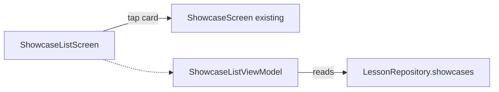

# Phase 03 — Showcase Tab (Root List → Existing ShowcaseScreen)

## Context Links

- Reports:
  - [/plans/reports/researcher-260506-0724-navigation3-multi-stack.md](../reports/researcher-260506-0724-navigation3-multi-stack.md)
  - [/plans/reports/researcher-260506-0724-bottom-bar-ux.md](../reports/researcher-260506-0724-bottom-bar-ux.md)
- Existing: `app/src/main/java/com/dantech/dreams/ui/feature/showcase/ShowcaseScreen.kt`
- Existing: `app/src/main/java/com/dantech/dreams/ui/feature/showcase/ShowcaseViewModel.kt`
- Existing: `app/src/main/java/com/dantech/dreams/data/lesson/LessonCategory.kt` (`SHOWCASE` entry)
- Existing: `app/src/main/java/com/dantech/dreams/data/lesson/source/showcase/` (3 lessons: liquid-glass, aurora-ribbons, raymarched-sphere)
- Existing: `app/src/main/java/com/dantech/dreams/domain/lesson/LessonRepository.kt`
- Phase-01 plan: [phase-01-navigation-shell-and-routes.md](phase-01-navigation-shell-and-routes.md)

## Overview

- Priority: P1
- Status: completed
- Brief: Showcase tab — 2-level drill-down. Root = `ShowcaseListScreen` (3 cards: Liquid Glass, Aurora Ribbons, Raymarched Sphere). Level 2 = existing `ShowcaseScreen` (full-bleed shader, kept as-is).

## Key Insights from Research

- The 3 showcase lessons live in the registry under `LessonCategory.SHOWCASE`. We add a clean repo accessor to avoid coupling UI to the enum value: `LessonRepository.showcases(): ImmutableList<LessonModel>`.
- Existing `ShowcaseScreen.kt:48-82` is fullscreen, no Scaffold, has its own back-arrow text overlay. Bottom bar must be hidden on this route — already covered by phase-01's `showBar` logic which excludes `Route.Showcase`.
- `ShowcaseScreen.kt:39-43` includes a back-arrow at `Alignment.TopStart` with 16dp padding. After bar hides and edge-to-edge applies, the arrow may sit under the status bar or be partially obscured. Worth a `Modifier.statusBarsPadding()` add — flagged in researcher report. Out-of-scope unless smoke test reveals issue (phase-06).

## Requirements

### Functional

- `ShowcaseListScreen` shows TopAppBar "Showcases" + LazyColumn of 3 cards.
- Each card displays title + screen-recording hint snippet.
- Tap card → navigate to `Showcase(lessonId)` (existing route from phase-01 / `Route.kt`).
- Existing `ShowcaseScreen` integrates without modification.
- Back from Showcase returns to Showcase root list.
- Bottom bar hidden on `Route.Showcase`, visible on `Route.ShowcaseRoot`.

### Non-Functional

- File size <200 lines.
- Reuse no `LessonCard` here (showcase cards have different visual emphasis — recording-hint subtitle, no favorite, no complexity stars). Custom card component, ~60 lines.

## Architecture



### Data Flow

- **ShowcaseListViewModel:** Constructor `(repo: LessonRepository)`. In `init` calls `repo.showcases()`. Exposes `StateFlow<ShowcaseListUiState(showcases: ImmutableList<LessonModel>)>`. No actions.

## Related Code Files

### Modify

- `/Users/dan/Desktop/Development/Android-Kotlin/dreams/app/src/main/java/com/dantech/dreams/domain/lesson/LessonRepository.kt`
  - Add: `fun showcases(): ImmutableList<LessonModel>` to interface.
- `/Users/dan/Desktop/Development/Android-Kotlin/dreams/app/src/main/java/com/dantech/dreams/data/lesson/LessonRepositoryImpl.kt`
  - Implement: `override fun showcases() = LessonRegistry.byCategory(LessonCategory.SHOWCASE)`.
- `/Users/dan/Desktop/Development/Android-Kotlin/dreams/app/src/main/java/com/dantech/dreams/core/di/FeatureModule.kt`
  - Add: `viewModel { ShowcaseListViewModel(get()) }`.
- `/Users/dan/Desktop/Development/Android-Kotlin/dreams/app/src/main/java/com/dantech/dreams/ui/feature/nav/MainShell.kt`
  - Replace stub `entry<Route.ShowcaseRoot> { Text(...) }` with `ShowcaseListScreen(onShowcaseClick = { id -> topLevel.add(Route.Showcase(id)) })`.
  - Add `entry<Route.Showcase> { route -> ShowcaseScreen(onBack = { topLevel.removeLast() }, vm = koinViewModel<ShowcaseViewModel> { parametersOf(route.lessonId) }) }`.

### Create

- `/Users/dan/Desktop/Development/Android-Kotlin/dreams/app/src/main/java/com/dantech/dreams/ui/feature/showcase/ShowcaseListScreen.kt` (~120 lines)
- `/Users/dan/Desktop/Development/Android-Kotlin/dreams/app/src/main/java/com/dantech/dreams/ui/feature/showcase/ShowcaseListViewModel.kt` (~30 lines)
- `/Users/dan/Desktop/Development/Android-Kotlin/dreams/app/src/main/java/com/dantech/dreams/ui/feature/showcase/ShowcaseListUiState.kt` (~15 lines)

### Delete

- None this phase.

## Implementation Steps

1. **Extend repo interface.** Add `showcases()` to `LessonRepository` interface and impl. This is the clean accessor recommended by the brief.

2. **Create `ShowcaseListUiState.kt`.**
   ```kotlin
   data class ShowcaseListUiState(
       val showcases: ImmutableList<LessonModel> = persistentListOf(),
   )
   ```

3. **Create `ShowcaseListViewModel.kt`.**
   - `class ShowcaseListViewModel(private val repo: LessonRepository) : ViewModel()`.
   - `private val _ui = MutableStateFlow(ShowcaseListUiState(repo.showcases()))`.
   - `val uiState: StateFlow<ShowcaseListUiState> = _ui.asStateFlow()`.

4. **Create `ShowcaseListScreen.kt`.**
   - `Scaffold` with TopAppBar "Showcases".
   - `LazyColumn` of `ShowcaseCard` private composables. Each card:
     - Card containing Column: Title (titleLarge), conceptIntro (bodyMedium 2-line clip), screenRecordingHint as small label "Recording: $hint" if present.
     - `clickable { onShowcaseClick(lesson.id) }`.
   - Receives `onShowcaseClick: (String) -> Unit`.

5. **Update `FeatureModule.kt`** with `ShowcaseListViewModel`.

6. **Update `MainShell.kt`** entry provider:
   - Replace `ShowcaseRoot` stub with `ShowcaseListScreen(onShowcaseClick = { id -> topLevel.add(Route.Showcase(id)) })`.
   - Add `Showcase` entry: existing `ShowcaseScreen(onBack = ..., vm = koinViewModel { parametersOf(route.lessonId) })`.

7. **Compile + smoke test.**
   - `./gradlew :app:assembleDebug`.
   - Install. Showcase tab → 3 cards (Liquid Glass, Aurora Ribbons, Raymarched Sphere). Tap → fullscreen showcase. Bottom bar hidden. Back → list. Bottom bar reappears.

## Todo List

- [ ] Add `LessonRepository.showcases()` interface + impl
- [ ] Create `ShowcaseListUiState.kt`, `ShowcaseListViewModel.kt`, `ShowcaseListScreen.kt`
- [ ] Register VM in `FeatureModule.kt`
- [ ] Wire 2 entries (ShowcaseRoot, Showcase) into `MainShell.kt`
- [ ] `./gradlew :app:assembleDebug` passes
- [ ] Manual smoke: 3 showcases listed, tap drills down, back returns

## Success Criteria

- Showcase tab root shows 3 cards.
- Tap card → existing ShowcaseScreen (zero behavior change).
- Bottom bar hidden during fullscreen showcase.
- Back from showcase returns to list with no animation glitches.
- No regression to existing showcase shader rendering.

## Risk Assessment

| Risk | Likelihood | Impact | Mitigation |
|---|---|---|---|
| `LessonRepository.showcases()` addition breaks `KoinModulesCheckTest` (verifies all repos) | Low | Low | Adding a method to the interface + impl together is safe; no DI binding change. |
| Edge-to-edge causes back-arrow in `ShowcaseScreen` to clip under status bar after bottom bar hides | Medium | Low | Add `Modifier.statusBarsPadding()` to the back-text Box (line ~71 of ShowcaseScreen). Defer to phase-06 unless visible in this phase's smoke. |
| `ShowcaseListScreen` and existing `ShowcaseScreen.kt` filename pair causes import confusion | Low | Low | Distinct names; explicit imports. Both live in `feature/showcase/`. |
| Test `KoinModulesCheckTest` fails because new VM not in FeatureModule | Low | Low | Step 5 covers this. |

## Security Considerations

n/a — UI refactor.

## Next Steps

- Phase-04 wires Settings.
- Phase-05 deletes obsolete code.

## File Ownership

This phase owns:
- `domain/lesson/LessonRepository.kt` (modify — additive)
- `data/lesson/LessonRepositoryImpl.kt` (modify — additive)
- `core/di/FeatureModule.kt` (modify — additive)
- `ui/feature/showcase/ShowcaseListScreen.kt` (create)
- `ui/feature/showcase/ShowcaseListViewModel.kt` (create)
- `ui/feature/showcase/ShowcaseListUiState.kt` (create)
- `ui/feature/nav/MainShell.kt` (modify — entry provider additions only)

Run sequentially with phase-02 and phase-04 to avoid `MainShell.kt` / `FeatureModule.kt` edit conflicts.
