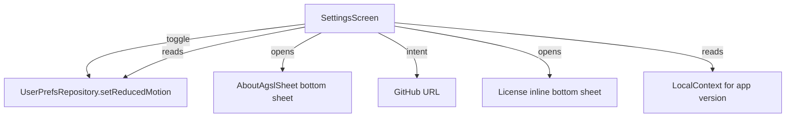

# Phase 04 — Settings Tab (Fullscreen Page + About AGSL)

## Context Links

- Reports:
  - [/plans/reports/researcher-260506-0724-bottom-bar-ux.md](../reports/researcher-260506-0724-bottom-bar-ux.md)
- Existing: `app/src/main/java/com/dantech/dreams/ui/feature/settings/SettingsSheet.kt` (will be replaced; deletion in phase-05)
- Existing: `app/src/main/java/com/dantech/dreams/ui/feature/landing/AboutAgslSheet.kt` (will be moved to settings/ this phase)
- Existing: `app/src/main/java/com/dantech/dreams/data/prefs/UserPrefsRepository.kt` (provides `setReducedMotion`)
- Phase-01 plan: [phase-01-navigation-shell-and-routes.md](phase-01-navigation-shell-and-routes.md)

## Overview

- Priority: P1
- Status: completed
- Brief: Settings tab — single fullscreen page (no drill-down). Two sections: **Display** (Reduced motion toggle), **About** (app version, "About AGSL" → bottom sheet, GitHub link, license). Move `AboutAgslSheet.kt` from `feature/landing/` → `feature/settings/` in this phase (delete-from-landing happens in phase-05 since landing dir is deleted wholesale).

## Key Insights from Research

- Material 3 spec: Settings should be a regular fullscreen page in the bottom tab — not a modal.
- About AGSL fits as a bottom sheet opened FROM SettingsScreen (it's a mini reference, not a destination).
- `UserPrefsRepository` already exposes `prefsFlow` and `setReducedMotion(Boolean)`. We can read directly via `koinInject()` in the screen (matches existing `SettingsSheet.kt:29-31` pattern) — no new ViewModel strictly necessary.
- However, KISS suggests a thin `SettingsViewModel` for symmetry with other features and to centralize `appVersion` reading via `Context` injection. Compromise: skip the VM (it would do almost nothing) and use `koinInject<UserPrefsRepository>()` + `LocalContext.current.packageManager` for version. **Decision: no VM** — saves ~40 lines, no behavioral cost.

## Requirements

### Functional

- Settings tab root shows TopAppBar "Settings" + scrollable Column.
- **Display section:**
  - Section header "Display".
  - Row: "Reduce motion" + subtitle "Skip transitions and shared element morphs." + `Switch` bound to `prefs.reducedMotionOverride`. Toggle calls `prefsRepo.setReducedMotion(value)`.
- **About section:**
  - Section header "About".
  - Row "App version" with version name + version code (read from PackageInfo).
  - Row "About AGSL" — clickable, opens existing `AboutAgslSheet` ModalBottomSheet.
  - Row "GitHub" — clickable, launches URL intent (placeholder URL acceptable; document as TODO if real URL not available).
  - Row "License" — clickable, opens a tiny inline ModalBottomSheet showing "Apache-2.0" + brief text.
- Bottom bar visible (Settings is a tab root, not a fullscreen route).
- No drill-down within Settings tab — single root entry.

### Non-Functional

- File <200 lines.
- No new ViewModel.
- Reuse Compose Material3 `ListItem` / custom row composables (KISS).
- Keep `AboutAgslSheet` content unchanged — only move package.

## Architecture



### Data Flow

- **In:** `prefsFlow` (collected via `collectAsStateWithLifecycle`); `LocalContext` for PackageManager.
- **Transform:** Direct binding — Switch state ↔ `prefs.reducedMotionOverride`.
- **Out:** `setReducedMotion(value)` writes to DataStore; flow emits new snapshot; Switch reflects.

## Related Code Files

### Modify

- `/Users/dan/Desktop/Development/Android-Kotlin/dreams/app/src/main/java/com/dantech/dreams/ui/feature/nav/MainShell.kt`
  - Replace stub `entry<Route.SettingsRoot> { Text(...) }` with `SettingsScreen()`.

### Create

- `/Users/dan/Desktop/Development/Android-Kotlin/dreams/app/src/main/java/com/dantech/dreams/ui/feature/settings/SettingsScreen.kt` (~140 lines)
- `/Users/dan/Desktop/Development/Android-Kotlin/dreams/app/src/main/java/com/dantech/dreams/ui/feature/settings/AboutAgslSheet.kt` (move from `feature/landing/AboutAgslSheet.kt`; copy contents; rename package to `com.dantech.dreams.ui.feature.settings`).

### Delete

- None this phase. Old `feature/landing/AboutAgslSheet.kt` and `SettingsSheet.kt` deleted in phase-05.

## Implementation Steps

1. **Copy `AboutAgslSheet.kt`.** Create `app/src/main/java/com/dantech/dreams/ui/feature/settings/AboutAgslSheet.kt` with identical contents to current `feature/landing/AboutAgslSheet.kt`, except change the package declaration to `com.dantech.dreams.ui.feature.settings`. Do NOT delete the original yet (phase-05 deletes the whole `feature/landing/` directory).

2. **Create `SettingsScreen.kt`.** Skeleton:
   ```kotlin
   @OptIn(ExperimentalMaterial3Api::class)
   @Composable
   fun SettingsScreen(prefsRepo: UserPrefsRepository = koinInject()) {
       val prefs by prefsRepo.prefsFlow.collectAsStateWithLifecycle(initialValue = UserPrefs.DEFAULT)
       val scope = rememberCoroutineScope()
       val ctx = LocalContext.current
       var aboutOpen by remember { mutableStateOf(false) }
       var licenseOpen by remember { mutableStateOf(false) }

       val versionName = remember(ctx) {
           runCatching {
               ctx.packageManager.getPackageInfo(ctx.packageName, 0).versionName
           }.getOrNull() ?: "?"
       }

       Scaffold(topBar = { TopAppBar(title = { Text("Settings") }) }) { padding ->
           Column(Modifier.padding(padding).verticalScroll(rememberScrollState())) {
               // Display section
               SectionHeader("Display")
               ReduceMotionRow(
                   checked = prefs.reducedMotionOverride,
                   onChecked = { v -> scope.launch { prefsRepo.setReducedMotion(v) } },
               )
               HorizontalDivider()
               // About section
               SectionHeader("About")
               LinkRow("App version", versionName)
               LinkRow("About AGSL", null, onClick = { aboutOpen = true })
               LinkRow("GitHub", "github.com/...", onClick = {
                   ctx.startActivity(Intent(Intent.ACTION_VIEW, Uri.parse("https://github.com/...")))
               })
               LinkRow("License", "Apache-2.0", onClick = { licenseOpen = true })
           }
       }
       if (aboutOpen) AboutAgslSheet(onDismiss = { aboutOpen = false })
       if (licenseOpen) LicenseSheet(onDismiss = { licenseOpen = false })
   }
   ```
   Plus three private helpers: `SectionHeader`, `ReduceMotionRow`, `LinkRow`, `LicenseSheet`. Keep file under 200 lines; if it overflows, split `LicenseSheet` into its own file.

3. **GitHub URL:** placeholder `https://github.com/dantech0xff/dreams` — TODO comment to confirm. Acceptable for MVP; do NOT block phase if URL unknown.

4. **Update `MainShell.kt`** entry provider: replace SettingsRoot stub with `SettingsScreen()`.

5. **Compile + smoke test.**
   - `./gradlew :app:assembleDebug`.
   - Install. Settings tab → see Display + About sections. Toggle Reduced motion → state persists; switch to another tab and back → state preserved. Tap "About AGSL" → existing bottom sheet content. Tap "GitHub" → browser opens (or document failing intent if URL placeholder rejected). Tap "License" → inline sheet shows Apache-2.0 text.

## Todo List

- [ ] Copy `AboutAgslSheet.kt` → `feature/settings/` (new package)
- [ ] Create `SettingsScreen.kt`
- [ ] Wire `Route.SettingsRoot` entry in `MainShell.kt`
- [ ] `./gradlew :app:assembleDebug` passes
- [ ] Manual smoke: toggle reduced motion, open About sheet, GitHub intent, License sheet

## Success Criteria

- Settings tab shows fullscreen page with Display + About sections.
- Reduced-motion toggle persists across app restart (DataStore).
- About AGSL bottom sheet content identical to current Landing's About sheet.
- GitHub link launches `Intent.ACTION_VIEW`.
- License sheet shows readable text.
- No drill-down within Settings tab; bottom bar always visible while in Settings.
- TopAppBar back button absent (this is a tab root, not a child route).

## Risk Assessment

| Risk | Likelihood | Impact | Mitigation |
|---|---|---|---|
| Two `AboutAgslSheet` files exist between phase-04 and phase-05 (in landing/ and settings/) | Certain | Low | Intentional to avoid breaking phase-04 build before phase-05 cleanup. Old `LandingScreen.kt` still imports `AboutAgslSheet` from `feature/landing/`. Phase-05 deletes both `LandingScreen.kt` and old `AboutAgslSheet.kt` together. |
| `PackageInfo.versionName` deprecated on newer SDKs | Low | Low | Acceptable; minSdk=33 still supports it. If lint errors, suppress for now; future cleanup. |
| GitHub URL placeholder ships to users | Medium | Low | Add `TODO(KAI-001)` comment in code; capture as unresolved Q below. |
| `Switch` writes happen rapidly (debounce concern) | Very Low | Low | Toggle is single-tap; no debounce needed. DataStore handles atomicity. |
| `LinkRow` composable count exceeds 200-line file budget | Low | Low | If exceeded, extract to `SettingsRows.kt`. Plan accommodates. |

## Security Considerations

- GitHub Intent.ACTION_VIEW with hardcoded URL — safe (no user input, no injection vector).
- No PII written.
- `PackageManager` query is the standard `getPackageInfo(packageName, 0)` — no permission needed.

## Next Steps

- Phase-05 deletes `feature/landing/`, old `SettingsSheet.kt`, drops `LandingViewModel` + `GalleryViewModel` from `FeatureModule.kt`, drops `Route.Landing` + `Route.Gallery`.

## File Ownership

This phase owns:
- `ui/feature/settings/SettingsScreen.kt` (create)
- `ui/feature/settings/AboutAgslSheet.kt` (create — moved from landing)
- `ui/feature/nav/MainShell.kt` (modify — entry provider addition only)

Run sequentially after phase-02/03 to avoid `MainShell.kt` edit conflicts.

## Unresolved Questions

- What is the canonical GitHub repo URL for this project? Currently using placeholder `https://github.com/dantech0xff/dreams`. Confirm before release.
