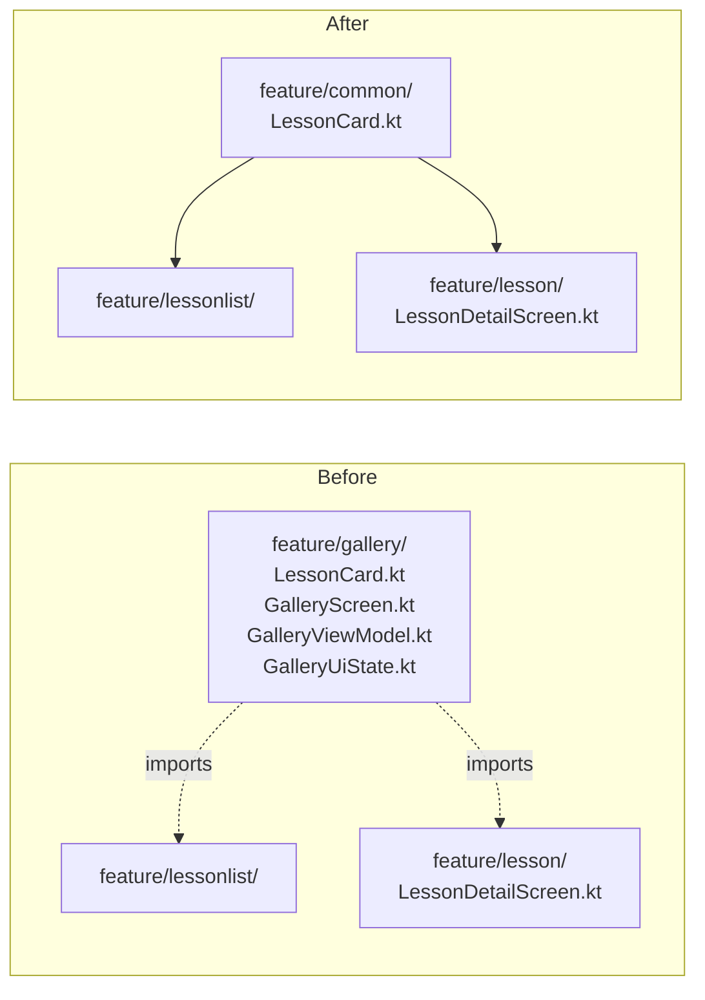

# Phase 05 — Cleanup & Deletion

## Context Links

- Reports:
  - [/plans/reports/researcher-260506-0724-navigation3-multi-stack.md](../reports/researcher-260506-0724-navigation3-multi-stack.md)
- Files marked for deletion (existing):
  - `app/src/main/java/com/dantech/dreams/ui/feature/landing/` (entire directory)
  - `app/src/main/java/com/dantech/dreams/ui/feature/gallery/GalleryScreen.kt`
  - `app/src/main/java/com/dantech/dreams/ui/feature/gallery/GalleryViewModel.kt`
  - `app/src/main/java/com/dantech/dreams/ui/feature/gallery/GalleryUiState.kt`
  - `app/src/main/java/com/dantech/dreams/ui/feature/settings/SettingsSheet.kt`
  - `app/src/main/java/com/dantech/dreams/ui/feature/nav/PlaygroundNavHost.kt`

## Overview

- Priority: P1 (blocks phase-06 validation; old code mustn't ship)
- Status: completed
- Brief: Delete obsolete code introduced before this rework. Move `LessonCard.kt` from `feature/gallery/` to `feature/common/` BEFORE deleting the gallery directory. Drop unused VMs from Koin DI. Drop unused routes.

## Key Insights

- `LessonCard.kt:1-82` is reused by phase-02's `LessonListScreen` and by `LessonDetailScreen.kt:43` (for `lessonSharedKey`). It must survive the deletion of `feature/gallery/`. Move it to `feature/common/` first.
- `LessonDetailScreen.kt:43` imports `com.dantech.dreams.ui.feature.gallery.lessonSharedKey`. After move, this import must change.
- `Route.Landing` and `Route.Gallery` are referenced only by old `PlaygroundNavHost.kt` (deleted this phase). After NavHost deletion, the route entries become unused — safe to remove.
- Tests directory: must check `app/src/test/` and `app/src/androidTest/` for references to deleted classes (`GalleryViewModel`, `LandingViewModel`, etc.). Per `docs/codebase-summary.md` there are VM tests; they must be deleted too.

## Requirements

### Functional

- App still builds and runs after deletion.
- All existing functionality from phases 1–4 still works.
- No dead imports or unused symbols.
- Koin DI graph passes `KoinModulesCheckTest.dataModule.verify()` (and equivalent feature module check, if any).

### Non-Functional

- Single atomic commit for the cleanup is acceptable; can be split into "move LessonCard" + "delete obsolete" sub-commits if review wants smaller diffs.

## Architecture



## Related Code Files

### Modify

- `/Users/dan/Desktop/Development/Android-Kotlin/dreams/app/src/main/java/com/dantech/dreams/ui/feature/lesson/LessonDetailScreen.kt`
  - Change import `com.dantech.dreams.ui.feature.gallery.lessonSharedKey` → `com.dantech.dreams.ui.feature.common.lessonSharedKey`.
- `/Users/dan/Desktop/Development/Android-Kotlin/dreams/app/src/main/java/com/dantech/dreams/ui/feature/lessonlist/LessonListScreen.kt` (created in phase-02)
  - Change import `com.dantech.dreams.ui.feature.gallery.LessonCard` → `com.dantech.dreams.ui.feature.common.LessonCard`.
- `/Users/dan/Desktop/Development/Android-Kotlin/dreams/app/src/main/java/com/dantech/dreams/ui/feature/nav/Route.kt`
  - Remove `Landing` and `Gallery` entries. Keep `LessonDetail`, `Showcase`, `LessonRoot`, `LessonList`, `ShowcaseRoot`, `SettingsRoot`.
  - Keep `routeForLessonId(id)` helper — still used.
- `/Users/dan/Desktop/Development/Android-Kotlin/dreams/app/src/main/java/com/dantech/dreams/core/di/FeatureModule.kt`
  - Remove `viewModel { LandingViewModel() }`.
  - Remove `viewModel { GalleryViewModel(get(), get(), get()) }`.
  - Remove imports for `LandingViewModel`, `GalleryViewModel`.

### Create

- `/Users/dan/Desktop/Development/Android-Kotlin/dreams/app/src/main/java/com/dantech/dreams/ui/feature/common/LessonCard.kt`
  - Identical contents to current `feature/gallery/LessonCard.kt` except `package` line → `com.dantech.dreams.ui.feature.common`.

### Delete

- `/Users/dan/Desktop/Development/Android-Kotlin/dreams/app/src/main/java/com/dantech/dreams/ui/feature/landing/LandingScreen.kt`
- `/Users/dan/Desktop/Development/Android-Kotlin/dreams/app/src/main/java/com/dantech/dreams/ui/feature/landing/LandingViewModel.kt`
- `/Users/dan/Desktop/Development/Android-Kotlin/dreams/app/src/main/java/com/dantech/dreams/ui/feature/landing/LandingUiState.kt`
- `/Users/dan/Desktop/Development/Android-Kotlin/dreams/app/src/main/java/com/dantech/dreams/ui/feature/landing/AboutAgslSheet.kt` (the old one; phase-04 already created the new one in `feature/settings/`)
- The whole `app/src/main/java/com/dantech/dreams/ui/feature/landing/` directory — empty after files removed.
- `/Users/dan/Desktop/Development/Android-Kotlin/dreams/app/src/main/java/com/dantech/dreams/ui/feature/gallery/GalleryScreen.kt`
- `/Users/dan/Desktop/Development/Android-Kotlin/dreams/app/src/main/java/com/dantech/dreams/ui/feature/gallery/GalleryViewModel.kt`
- `/Users/dan/Desktop/Development/Android-Kotlin/dreams/app/src/main/java/com/dantech/dreams/ui/feature/gallery/GalleryUiState.kt`
- `/Users/dan/Desktop/Development/Android-Kotlin/dreams/app/src/main/java/com/dantech/dreams/ui/feature/gallery/LessonCard.kt` (after move to `feature/common/`)
- The whole `app/src/main/java/com/dantech/dreams/ui/feature/gallery/` directory — empty after files removed.
- `/Users/dan/Desktop/Development/Android-Kotlin/dreams/app/src/main/java/com/dantech/dreams/ui/feature/settings/SettingsSheet.kt`
- `/Users/dan/Desktop/Development/Android-Kotlin/dreams/app/src/main/java/com/dantech/dreams/ui/feature/nav/PlaygroundNavHost.kt`
- Any test files in `app/src/test/` that reference `LandingViewModel`, `GalleryViewModel`, or `Route.Landing`/`Route.Gallery`. (Run grep step in implementation to enumerate; per docs there are VM tests for both.)

## Implementation Steps

1. **Pre-flight grep** to enumerate all references that will break:
   ```bash
   grep -rn "feature\.landing\|feature\.gallery\|Route\.Landing\|Route\.Gallery\|PlaygroundApp\|PlaygroundNavHost\|SettingsSheet\|LandingViewModel\|GalleryViewModel\|GalleryUiState\|LandingUiState" /Users/dan/Desktop/Development/Android-Kotlin/dreams/app/src/
   ```
   Expected hits (confirm before proceeding):
   - `MainActivity.kt` — already rewired in phase-01; no `PlaygroundApp` reference left.
   - `LessonDetailScreen.kt:43` — uses `feature.gallery.lessonSharedKey`. Will fix in step 4.
   - `phase-02 created LessonListScreen` — uses `feature.gallery.LessonCard`. Will fix in step 4.
   - `FeatureModule.kt` — registers Landing/Gallery VMs. Fix in step 6.
   - `app/src/test/` — VM tests if any. Delete in step 7.

2. **Move `LessonCard.kt`**: copy `feature/gallery/LessonCard.kt` → `feature/common/LessonCard.kt`. Change package to `com.dantech.dreams.ui.feature.common`. Keep the public top-level fun `lessonSharedKey(lessonId: String) = "lesson-card-$lessonId"`.

3. **Update imports** for two consumers:
   - `LessonDetailScreen.kt:43` — `com.dantech.dreams.ui.feature.gallery.lessonSharedKey` → `com.dantech.dreams.ui.feature.common.lessonSharedKey`.
   - `LessonListScreen.kt` (phase-02) — `com.dantech.dreams.ui.feature.gallery.LessonCard` → `com.dantech.dreams.ui.feature.common.LessonCard`.

4. **Compile checkpoint**: `./gradlew :app:assembleDebug`. Must pass — confirms move worked before deletions.

5. **Delete old `LessonCard.kt`** in `feature/gallery/`.

6. **Delete remaining `feature/gallery/` files**: `GalleryScreen.kt`, `GalleryViewModel.kt`, `GalleryUiState.kt`. Then remove the empty directory.

7. **Delete entire `feature/landing/`**: `LandingScreen.kt`, `LandingViewModel.kt`, `LandingUiState.kt`, `AboutAgslSheet.kt`. Remove the empty directory.

8. **Delete `feature/settings/SettingsSheet.kt`**.

9. **Delete `feature/nav/PlaygroundNavHost.kt`**.

10. **Update `Route.kt`**: remove `Landing` and `Gallery` data objects. Keep everything else.

11. **Update `FeatureModule.kt`**: remove `LandingViewModel` + `GalleryViewModel` lines and their imports.

12. **Compile checkpoint**: `./gradlew :app:assembleDebug`.

13. **Test grep**:
    ```bash
    grep -rn "Landing\|Gallery\|PlaygroundApp" /Users/dan/Desktop/Development/Android-Kotlin/dreams/app/src/test/ /Users/dan/Desktop/Development/Android-Kotlin/dreams/app/src/androidTest/ 2>/dev/null
    ```
    Delete any test files that reference deleted classes. Examples likely:
    - `app/src/test/.../LandingViewModelTest.kt`
    - `app/src/test/.../GalleryViewModelTest.kt`
    - Any nav-flow androidTest referencing `Route.Landing` / `Route.Gallery`.

14. **Run unit tests**: `./gradlew test`. Must pass (or pass minus deleted tests). `KoinModulesCheckTest` must succeed.

15. **Lint check**: `./gradlew :app:lintDebug` (best-effort; informational).

## Todo List

- [ ] Pre-flight grep enumerates all references
- [ ] Copy `LessonCard.kt` to `feature/common/`
- [ ] Update import in `LessonDetailScreen.kt`
- [ ] Update import in `LessonListScreen.kt`
- [ ] Compile passes after move
- [ ] Delete old `feature/gallery/LessonCard.kt`
- [ ] Delete `feature/gallery/{GalleryScreen,GalleryViewModel,GalleryUiState}.kt` + dir
- [ ] Delete `feature/landing/` directory
- [ ] Delete `feature/settings/SettingsSheet.kt`
- [ ] Delete `feature/nav/PlaygroundNavHost.kt`
- [ ] Remove `Route.Landing` + `Route.Gallery` from `Route.kt`
- [ ] Remove Landing+Gallery VM bindings from `FeatureModule.kt`
- [ ] Compile passes
- [ ] Delete test files referencing deleted classes
- [ ] `./gradlew test` passes (KoinModulesCheckTest green)

## Success Criteria

- `./gradlew :app:assembleDebug` passes.
- `./gradlew test` passes.
- No source file references `LandingViewModel`, `GalleryViewModel`, `Route.Landing`, `Route.Gallery`, `PlaygroundApp`, `PlaygroundNavHost`, `feature.landing.*`, `feature.gallery.*`, `feature.settings.SettingsSheet`.
- `app/src/main/java/com/dantech/dreams/ui/feature/landing/` and `.../gallery/` directories no longer exist.
- App installs and runs identically to end of phase-04.

## Risk Assessment

| Risk | Likelihood | Impact | Mitigation |
|---|---|---|---|
| Deleting `LessonCard.kt` from gallery before its consumers are updated breaks build | High if done out-of-order | High | Strict step order: copy first (step 2), update imports (step 3), compile checkpoint (step 4), then delete (step 5). |
| `KoinModulesCheckTest` fails because feature module references VMs whose tests reference deleted classes | Medium | Medium | Step 13 enumerates test files; step 14 runs tests. If `KoinModulesCheckTest` fails, regenerate test fixture. |
| Hidden reference (e.g. in `AndroidManifest.xml`, comments referencing classes) | Low | Low | Step 1's grep covers `app/src/`; manifest does NOT reference Composable classes. |
| `LessonDetailScreen.kt:43` uses `lessonSharedKey` from gallery — typo'd import after move | Low | Medium | Step 4 compile checkpoint catches before deletion. |
| Tests in `app/src/test/` rely on `Route.Landing` for nav-stack tests | Medium | Low | Step 13 enumerates; delete obsolete tests. New nav-stack tests are out of scope (no new tests required per brief). |
| `git rm -r` mishaps removing wrong directory | Low | High | Use individual file deletes via Edit/Read tools, NOT rm -r. Plan implementation phase will use careful single-file deletion. |

## Security Considerations

n/a — code deletion only.

## Next Steps

- Phase-06 validates the final state with manual smoke test.

## File Ownership

This phase owns ALL files marked for deletion + the modify list above. No other phase touches these files at the same time. Run STRICTLY AFTER phases 2/3/4 complete.

## Unresolved Questions

- Are there any other consumers of `Route.Landing` or `Route.Gallery` in `androidTest/` (e.g. nav-flow tests)? Will be enumerated in step 13.
